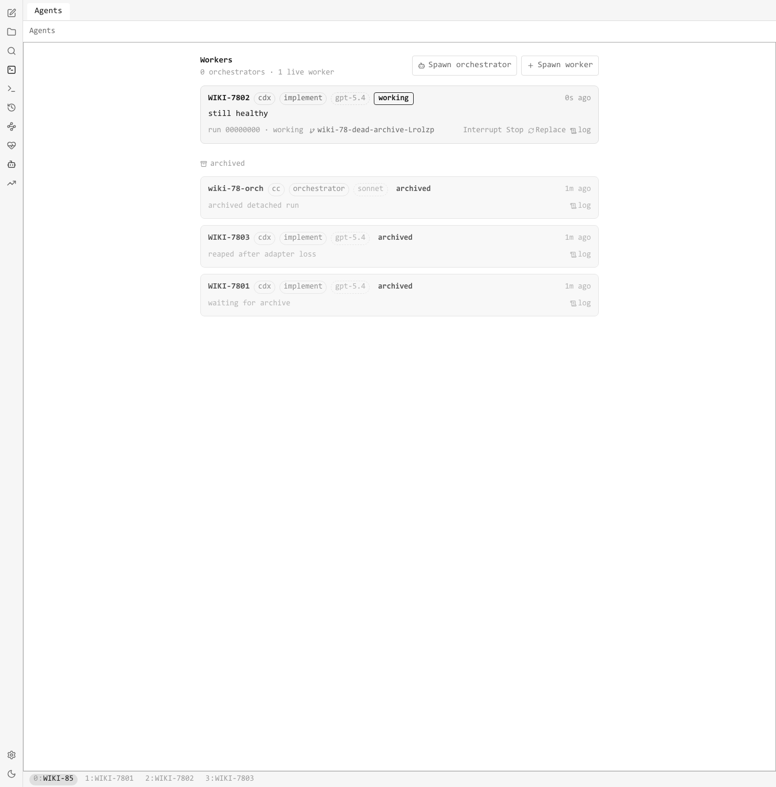
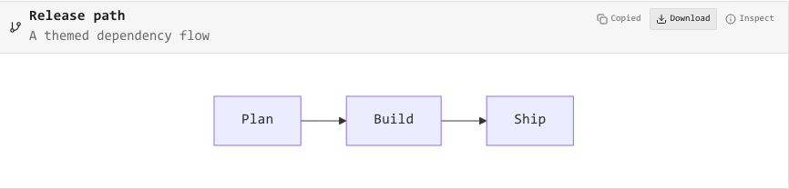
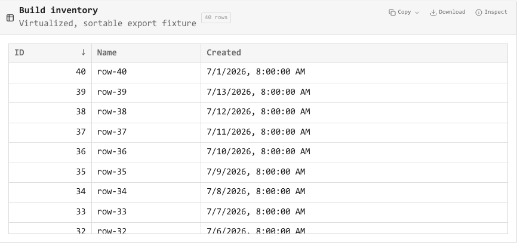
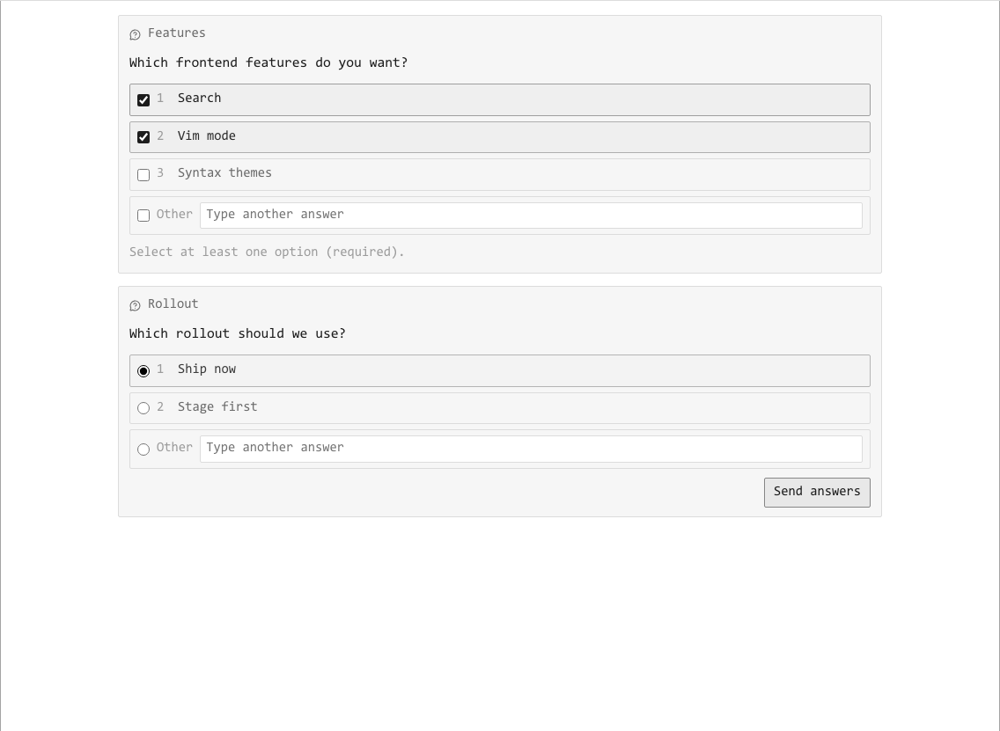

# Wiki

A local Markdown note vault, an in-app agent fleet (Codex + Claude Code), and a native macOS shell — one repo.

Notes live as plain files in `vault/`. The fleet page spawns headless provider workers, streams their turns, renders their artifacts, and steers them without leaving the app.

## Screenshots

**Fleet view** — every worker + orchestrator, live state, one-click Archive on dead runs.



**Inline artifacts** — agents call `render_artifact` and the payload renders in the transcript. Mermaid, SVG, images, sortable tables, Vega-Lite plots, code + diffs.




**AskUserQuestion** — Claude prompts render as inline cards; multi-select supported.



## Project layout

```
backend/     FastAPI: notes, agent supervisor, artifact serve
frontend/    Vite + React: vault browser, editor, agent session view
vault/       Plain Markdown; safe to edit directly
src-tauri/   Native macOS shell around the built frontend + frozen sidecar
```

## Setup

```bash
python3 -m venv .venv
.venv/bin/pip install -r backend/requirements.txt
cd frontend && npm install
```

## Run (web)

```bash
make dev   # backend on :8011, frontend on :5173
```

Open http://localhost:5173. Custom backend port: set `WIKI_API_TARGET=http://127.0.0.1:<port>` before `npm run dev`.

## Run (native macOS)

```bash
make native-build   # stages, then atomically swaps Wiki.app when Wiki is closed
open src-tauri/target/release/bundle/macos/Wiki.app
```

`make native-dev` runs the Tauri shell with a live sidecar. Ad-hoc signed, no notarization — quarantined copies may need right-click Open once. Sidecar logs live at `~/Library/Logs/Wiki/`.

Native builds refuse to replace a bundle while Wiki.app or its supervisor is running. The backend holds an app-lifetime lock at `~/.wiki/agent-runtime/app.lock`; the build holds both that lock and `supervisor.lock` across the final swap. To prepare a build while Wiki is open, use `make native-build FORCE_STAGE_ONLY=1`; after quitting Wiki, run the printed `./scripts/swap-native-app.sh <stage-root>` command. Successful deferred swaps remove the stage tree; interrupted cleanup is retried by the next native build via its `.swap-complete` sentinel.

The first build after upgrading from an older sidecar (before it creates `app.lock`) must be explicit: `make native-build ALLOW_MISSING_APP_LOCK=1`. This is safe only after quitting Wiki and confirming the supervisor lock is free; subsequent builds use the app lock as the authoritative app-liveness signal. PID files are advisory only.

## Fleet leader (`Ctrl+A`)

| Chord | Action |
| --- | --- |
| `C-a j` / `k` | Cycle pane focus in the current window |
| `C-a h` / `l` | Previous / next window |
| `C-a 0`–`9` | Jump to window slot |
| `C-a w` | Open the run / open-note chooser |
| `C-a p` | Split the focused pane with a blank pane |
| `C-a x` | Close the focused pane |
| `C-a z` | Zoom / unzoom the focused pane |
| `C-a ,` | Settings |

## API

- `GET  /api/notes` — list
- `GET  /api/notes/{path}` — read
- `POST /api/notes` — create
- `PUT  /api/notes/{path}` — update
- `POST /api/agents/spawn` — spawn worker
- `POST /api/agents/{id}/message` — steer
- `POST /api/agents/{id}/archive` — wrap up
- `GET  /api/agents/{ticket}/artifact/{uuid}` — serve artifact bytes

Set `WIKI_VAULT_DIR=/path/to/vault` to point at a different vault.
