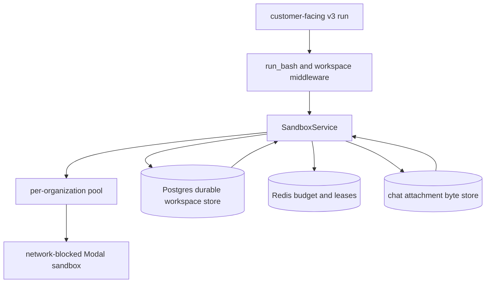
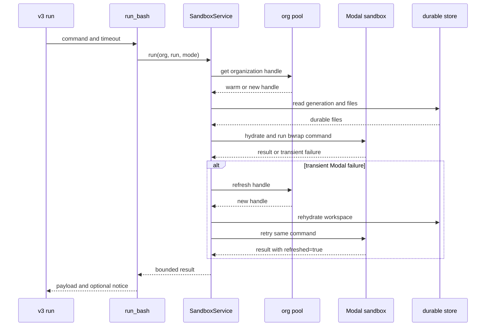

# v3 agent Modal sandbox design

The customer-facing v3 agent uses one network-blocked Modal sandbox per
organization. Each run gets a derived, mode-scoped workspace. Durable files
rehydrate after sandbox recycle. The v3 admin agent is out of scope.

Source snapshot: PR #15357, commit `83d00798e9` (`PHO-16987: Freshen the
containment sandbox`). The design also reflects the 2026-08-26 decision in
[[v3-sandbox-single-image-decision]] and the wider harness direction in
[[v3-harness-design]].

## purpose and scope

This subsystem gives the customer-facing v3 agent a bounded place to inspect,
transform, and present data. It supports `run_bash`, tool-result spill,
workspace references, user uploads, and chat attachments.

It does not provide live database access from the sandbox. The `query` tool
reads data through a separate read-only, mode-strict database role. The
sandbox receives only files selected by the v3 runtime.

This document does not describe the internal v3 admin agent. The admin agent
has separate tools, policies, and sandbox history.

## architecture

The sandbox is a warm compute cache. The durable workspace store is the source
for recovery. Redis owns both command capacity and workspace leases.

`SandboxService.run()` takes a workspace lease and a command budget, gets the
organization handle, hydrates the run workspace, then invokes the confined
runner (`libraries/python/agent_sandbox/sandbox.py:563-666`). A transient Modal
failure refreshes the handle, hydrates again, and retries the command once.

The local pool keeps an LRU map of organization handles. It creates named
 sandboxes with `agent-bash-<organization-hex>-<image-version>` names. The
name includes the image version, so a changed recipe cannot reuse an old
organization sandbox (`libraries/python/agent_sandbox/sandbox.py:294-463`).

## the single-image design

### image contents

Every v3 surface uses the same analysis image. It starts with Debian slim and
Python 3.13. The sandbox layer adds the pinned Debian snapshot packages:

`bubblewrap=0.8.0-2+deb12u1`, `coreutils=9.1-1`, `file=1:5.44-3`,
`findutils=4.9.0-4`, `grep=3.8-5`, `jq=1.6-2.1`, `mawk=1.3.4.20200120-3.1`,
`python3=3.11.2-1+b1`, `ripgrep=13.0.0-4+b2`, `sed=4.9-1`, and
`tzdata=2025b-0+deb12u1` (`libraries/python/agent_sandbox/sandbox.py:98-131`).

The top-level, hash-locked analysis packages are:

- `matplotlib==3.10.3`
- `numpy==2.2.6`
- `pandas==2.2.3`
- `pypdf==5.6.0`
- `reportlab==4.4.2`
- `scipy==1.15.3`
- `seaborn==0.13.2`
- `statsmodels==0.14.4`

The lock file includes the full transitive closure. Image build installation
uses `--require-hashes --no-cache-dir --disable-pip-version-check`
(`libraries/python/agent_runtime/modal_images.py:88-135`). The image also
bakes `phoebe_chart_style.py` into site-packages and sets
`MPLBACKEND=Agg` (`libraries/python/agent_runtime/modal_images.py:74-85,
187-212`).

The image has no runtime package installation path. The data-analysis skill
requires `python3` through `run_bash`, names the exact preloaded packages, and
forbids installation because runtime network access is disabled
(`libraries/python/phoebe_v3_agent/prompts/skills/data_analysis.md:19-27`).

### fingerprint and rebuild behavior

`analysis_image_fingerprint()` hashes the image specification, lockfile bytes,
style bytes, install options, and environment. `_image_version()` adds the
APT snapshot, package list, install command, and VM runtime version. It uses
the first 16 hexadecimal characters of the final SHA-256 digest
(`libraries/python/agent_runtime/modal_images.py:204-212`,
`libraries/python/agent_sandbox/sandbox.py:454-463`).

That digest enters the sandbox name. Any analysis recipe, chart-style file,
APT package, or runtime version change therefore creates a new sandbox name.
All organizations pay the rebuild cost when the image changes.

### decision history

The earlier design split `MINIMAL` and `ANALYSIS` profiles. The split existed
because runtime `pip` needed PyPI egress, which could leak through the shared
per-organization pool into a read-only surface. The later rounds baked the
packages into the image, locked every package hash, and blocked runtime
network access. The security reason for two profiles then disappeared.

Henry removed the split on 2026-08-26. One image removes duplicate containers
and avoids cross-container workspace receipt readback failures. The accepted
tradeoff is a heavier image for every organization, including read-only
surfaces. See [[v3-sandbox-single-image-decision]].

## request types

### bash command execution

`run_bash` validates a non-empty command, a maximum command size of 16,000
UTF-8 bytes, and a timeout from 1 to 600 seconds. The default timeout is 30
seconds (`libraries/python/phoebe_v3_agent/tools/bash/tool.py:33-63`). It uses
the current run, organization, and mode.

The service holds the run workspace lease and both Redis command leases. It
gets or creates the organization's Modal sandbox, then runs the command with
the run workspace mounted as `/workspace`. The command executes through
`bwrap` with all namespaces unshared, a private PID namespace, a private `/tmp`,
and a writable bind only for that run directory
(`libraries/python/agent_sandbox/confinement.py:58-145`).

The runner adds a Python watchdog around the bwrap command. It creates a
per-command cgroup, sets CPU, memory, and PID limits, captures each output
stream, and kills the process tree on timeout or cancellation
(`libraries/python/agent_sandbox/exec.py:398-708`). A cgroup failure is not
silently accepted in production: `SandboxService` requires cgroup support when
it calls the runner (`libraries/python/agent_sandbox/sandbox.py:1552-1577`).

On success, the tool returns exit code, stdout, stderr, truncation flags,
timeout state, resource-limit state, degraded-limit state, and duration. A
successful, non-timeout command also scans and publishes JSONL register files.
If the sandbox was refreshed, the response includes `sandbox_notice`
(`libraries/python/phoebe_v3_agent/tools/bash/tool.py:101-160`).

Transient `NotFoundError`, `SandboxTerminatedError`, and `SandboxTimeoutError`
cause one refresh, hydration, and command retry. The retry stays inside the
same command and workspace leases (`libraries/python/agent_sandbox/sandbox.py:618-666`).

### workspace file write and tool receipt spill

The middleware wraps v3 tool groups. Small results stay inline. A result over
500 characters, or a result with `to_sandbox=true`, is serialized as JSON,
JSONL, or CSV and written to the run workspace. The response is a bounded
envelope with `artifact_path`, format, row count, schema hint, preview, and a
`ws://` reference (`libraries/python/phoebe_v3_agent/middleware/workspace.py:99-138,
256-264`).

The spool takes an index lock, reads `tool_outputs/index.jsonl`, assigns the
next ordinal, writes the artifact, then writes the new index. Paths look like
`/workspace/tool_outputs/0001_query.jsonl`. The index records the tool, call
ID, arguments, path, format, and row count
(`libraries/python/phoebe_v3_agent/middleware/workspace.py:440-496`).

`SandboxService.write_file()` persists the bytes to Postgres before it writes
the working copy in Modal. This fail-closed order protects the recovery copy.
The index is exempt from the 100 MiB run cap so its manifest can keep advancing
(`libraries/python/agent_sandbox/sandbox.py:668-801`,
`libraries/python/agent_sandbox/durable.py:296-379`).

Streamed query results use a spooled temporary file. The middleware keeps only
the first three rows for the preview, counts rows, and spills at the token
boundary or when explicitly requested (`libraries/python/phoebe_v3_agent/middleware/workspace.py:266-438`).

`edit_caregiver_selection` is a deliberate exception. It keeps its bounded
receipt inline, but writes the full JSON details file in the same artifact and
index layout. If that write fails after the selection mutation commits, the
tool still returns its truncated inline receipt
(`libraries/python/phoebe_v3_agent/tools/outreach/edit_selection.py:640-735`).

### file readback: `read_file`, `describe_file`, and `read_rows`

The service has two read paths. `read_file` returns raw bytes for trusted
runtime operations such as reading the spill index. `read_bounded_file` reads
one regular file under a caller-supplied byte limit. Both paths derive the
workspace from organization, run, and mode, then hydrate before reading
(`libraries/python/agent_sandbox/sandbox.py:803-907`).

Workspace references use `ws://tool_outputs/result.jsonl` or
`/workspace/tool_outputs/result.jsonl`. The resolver rejects traversal,
unsupported extensions, missing files, oversized files, symlinks, invalid UTF-8,
and malformed JSON, JSONL, or CSV. It compacts valid content into a bounded
JSON string before passing it to a tool. This keeps file contents out of the
model request until a tool explicitly consumes the reference
(`libraries/python/phoebe_v3_agent/middleware/workspace_refs.py:97-304`).

The v3 output contract keeps `describe_file` and `read_rows` inline because
their receipts are bounded. They consume the same workspace artifact contract
and are listed as spill-exempt tools (`libraries/python/phoebe_v3_agent/middleware/output_contract.py:22-56`).
The `edit_caregiver_selection` details-file path also calls out these consumers
as the intended way to inspect a full receipt.

Guarantees:

- mode and run identity are part of every service read;
- model-supplied paths are relative, normalized, and safe-segment checked;
- reads are bounded by the 10 MiB file cap unless a smaller caller cap binds;
- a stale reference returns a typed `stale_or_missing` error with a repair hint;
- a workspace reference never grants access to another run or mode.

### register publish

After each successful, non-timeout `run_bash`, the tool calls
`publish_workspace_registers`. The service lists files in the workspace, keeps
`.jsonl` files, validates each file, and persists valid files. It returns at
most 32 receipts plus totals for persisted, failed, and omitted files
(`libraries/python/agent_sandbox/sandbox.py:1135-1231`).

Validation requires UTF-8 JSON objects, no blank rows, no non-standard JSON
constants, at most 100,000 rows, at most 64 columns, and column names no longer
than 128 bytes. CSV registers require a non-empty, unique header
(`libraries/python/agent_sandbox/jsonl.py:15-21,77-180`).

Register publication does not publish arbitrary files. A PNG created by
`run_bash` is read by `send_chat_attachment` through its dedicated attachment
path. A malformed, missing, symlinked, oversized, or persistence-capped JSONL
file gets a receipt reason. The bash tool turns a persistence failure into a
curated `ToolCallError`.

### user uploads

The upload path stores inbound bytes in the chat attachment byte store and
records metadata under the organization, mode, and run. It enforces the
per-run upload cap before persistence. A newly inserted upload bumps the run's
durable `workspace_generation` (`libraries/python/phoebe_agent_run_user_uploads/persistence.py:190-234`).

Binding existing uploads to a run also bumps the generation when it changes
rows (`libraries/python/phoebe_agent_run_user_uploads/persistence.py:362-383`).
The generation is the cross-process signal that a warm sandbox must reload its
workspace.

Uploads hydrate under `user_uploads/`. The loader includes bound uploads and
recent active inbound uploads, loads bytes through the byte-store boundary,
clears the old `user_uploads` directory, and writes the current set
(`libraries/python/phoebe_agent_run_chat_attachments/storage.py:260-308`,
`libraries/python/agent_sandbox/sandbox.py:1357-1381`).

### hydration and recycle

Hydration creates the run directory, publishes the current workspace fence,
and checks the durable run generation. A cache hit requires the same Modal
object ID and the same generation. Otherwise the service loads durable spill
files, reconciles inbound uploads, and records the new `(object_id, generation)`
pair (`libraries/python/agent_sandbox/sandbox.py:1280-1385`).

The durable store is the recovery source. It compresses content with zlib and
stores rows keyed by organization, mode, run, and path. Recycle loses
container-only scratch, but durable spill files and inbound uploads return on
the next hydration. A sandbox recycle does not change the run identity or
workspace path.

`_persist_spill_file` currently does not bump `workspace_generation` after a
spill write. In the single-container design, the same process writes the
working copy immediately, so this is benign for the normal path. A future
multi-container or cross-process writer would need a generation bump, or an
equivalent invalidation signal. The generation does bump for upload changes and
durable workspace deletion.

The configured workspace TTL is seven days. Cleanup leases each expired
workspace, removes its warm directory, deletes durable rows, removes activity
metadata, and clears the in-process hydration cache
(`libraries/python/agent_sandbox/sandbox.py:1441-1550`).

## timeouts, limits, and concurrency

The table covers the subsystem constants that bind command execution, image
lifecycle, workspace storage, register publication, and readback. Query limits
are included because query output is the main workspace producer.

| constant | value | source |
| --- | ---: | --- |
| `AGENT_SANDBOX_DEFAULT_COMMAND_TIMEOUT_S` | 30 s | `libraries/python/agent_sandbox/settings.py:25-28` |
| `AGENT_SANDBOX_MAX_COMMAND_TIMEOUT_S` | 600 s | `libraries/python/agent_sandbox/settings.py:25-28` |
| `AGENT_SANDBOX_MAX_COMMAND_BYTES` | 16,000 bytes | `libraries/python/agent_sandbox/settings.py:25-30` |
| `AGENT_SANDBOX_MAX_OUTPUT_BYTES` | 30,000 bytes per stream | `libraries/python/agent_sandbox/settings.py:25-29` |
| `AGENT_SANDBOX_CPU` | 0.5 Modal CPU | `libraries/python/agent_sandbox/settings.py:30-34` |
| `AGENT_SANDBOX_MEMORY_MIB` | 1,024 MiB Modal memory | `libraries/python/agent_sandbox/settings.py:30-34` |
| `AGENT_SANDBOX_CPU_LIMIT_S` | 60 CPU seconds | `libraries/python/agent_sandbox/settings.py:30-34` |
| `AGENT_SANDBOX_MEMORY_LIMIT_MIB` | 512 MiB per command | `libraries/python/agent_sandbox/settings.py:30-34` |
| `AGENT_SANDBOX_PID_LIMIT` | 1,024 processes | `libraries/python/agent_sandbox/settings.py:30-34` |
| `AGENT_SANDBOX_CAPTURE_TMPFS_BYTES` | 16 MiB | `libraries/python/agent_sandbox/settings.py:35-42` |
| `AGENT_SANDBOX_TMP_TMPFS_BYTES` | 64 MiB | `libraries/python/agent_sandbox/settings.py:35-42` |
| `AGENT_SANDBOX_LIFETIME_S` | 24 h | `libraries/python/agent_sandbox/settings.py:35-37` |
| `AGENT_SANDBOX_IDLE_TIMEOUT_S` | 1 h | `libraries/python/agent_sandbox/settings.py:35-37` |
| `AGENT_SANDBOX_WORKSPACE_TTL_S` | 7 days | `libraries/python/agent_sandbox/settings.py:35-38` |
| `AGENT_SANDBOX_MAX_TRACKED_ORGS` | 64 local pool entries | `libraries/python/agent_sandbox/settings.py:37-40` |
| `AGENT_SANDBOX_MAX_CONCURRENCY` | 16 global commands | `libraries/python/agent_sandbox/settings.py:39-40` |
| `AGENT_SANDBOX_MAX_CONCURRENCY_PER_ORG` | 2 commands per organization | `libraries/python/agent_sandbox/settings.py:39-40` |
| `WORKSPACE_LEASE_TIMEOUT_S` | 300 s | `libraries/python/agent_sandbox/activity.py:33-35` |
| workspace lease blocking timeout | 30 s | `libraries/python/agent_sandbox/activity.py:33-35` |
| workspace lease renewal interval | 60 s, bounded by one-third of lease timeout | `libraries/python/agent_sandbox/activity.py:33-35,488-517` |
| command budget acquire wait | 30 s | `libraries/python/agent_sandbox/budget.py:44-71` |
| command budget heartbeat | 45 s | `libraries/python/agent_sandbox/budget.py:19-23` |
| `MAX_SPILL_FILE_BYTES` | 10 MiB per file | `libraries/python/agent_sandbox/workspace.py:15-18` |
| `MAX_SPILL_BYTES` | 100 MiB per run, uncompressed | `libraries/python/agent_sandbox/durable.py:32-35` |
| `V3_SPILL_THRESHOLD_CHARS` | 500 characters | `libraries/python/phoebe_v3_agent/middleware/output_contract.py:22-32` |
| spill preview | 3 rows, 1,024 bytes | `libraries/python/phoebe_v3_agent/middleware/output_contract.py:22-25` |
| spill envelope | 4,096 bytes | `libraries/python/phoebe_v3_agent/middleware/output_contract.py:30-32` |
| `MAX_WORKSPACE_REGISTER_RECEIPTS` | 32 receipts | `libraries/python/agent_sandbox/sandbox.py:138-140` |
| JSONL render rows | 100,000 rows | `libraries/python/agent_sandbox/jsonl.py:15-21` |
| render columns | 64 columns, 128 bytes each | `libraries/python/agent_sandbox/jsonl.py:18-21` |
| render page size | 200 rows | `libraries/python/agent_sandbox/jsonl.py:18-23` |
| query default limit | 25 rows | `libraries/python/phoebe_v3_agent/tools/query/engine/limits.py:10-12` |
| query maximum inline limit | 50 rows | `libraries/python/phoebe_v3_agent/tools/query/engine/limits.py:10-12` |
| query sandbox limit | 10,000 rows | `libraries/python/phoebe_v3_agent/tools/query/engine/limits.py:14-17` |
| query sandbox prefetch | 100 rows | `libraries/python/phoebe_v3_agent/tools/query/engine/limits.py:14-17` |
| query inline token limit | 40,000 tokens | `libraries/python/phoebe_v3_agent/tools/query/engine/limits.py:19-20` |
| query statement timeout | 5 s | `libraries/python/phoebe_v3_agent/tools/query/engine/limits.py:28-32` |

The global and per-organization command semaphores use Redis leases. A command
must hold both. The lease heartbeat runs every 45 seconds. If Redis reports a
lost lease, the owner task is cancelled, and the agent sees a lease-loss
failure. Two per-organization slots and a maximum 600-second command can
starve a sibling run through repeated busy responses; the system does not
claim fair queuing.

Workspace read-modify-write operations use a separate renewable workspace
lease. The lease also owns a mutation lock and a monotonic fence version. File
writes publish the fence into the workspace before changing bytes. This stops
a stale worker from writing after lease loss (`libraries/python/agent_sandbox/activity.py:330-465`,
`libraries/python/agent_sandbox/files.py:274-386`).

## failure modes and the agent-visible surface

| failure | what the agent sees | recovery |
| --- | --- | --- |
| sandbox disabled by `AGENT_SANDBOX_DISABLED` | `ToolCallError`, code `not_allowed`, “Bash is unavailable for this agent run.” | Continue without bash or ask for a non-sandbox answer. |
| missing deployed Modal or workspace credentials | `ToolCallError`, code `not_allowed`, configuration text | Fix deployment configuration. |
| empty, oversized, or invalid-timeout command | `ToolCallError`, code `invalid_input` | Send a non-empty command under 16,000 bytes and a 1–600 second timeout. |
| global or per-org capacity exhausted | `AgentSandboxBusyError`: retry shortly or continue without it | Retry with backoff or continue without the sandbox. |
| workspace lease or command lease lost | lease-loss unavailable error; the active command is cancelled | Retry the operation after the lease clears. |
| command wall-time exceeded | payload has `exit_code=124`, `timed_out=true`, and a timeout message in stderr | Narrow the command or raise `timeout_s` within 600 seconds. |
| stdout or stderr exceeds 30,000 bytes | payload sets the matching truncation flag | Read or write a file and inspect it in smaller pieces. |
| CPU, memory, or PID cap reached | payload names `resource_limit` as `cpu`, `memory`, or `pids` | Reduce work, rows, processes, or memory use. |
| cgroup support is unavailable | configuration-unavailable `ToolCallError` | Use a Modal VM runtime with writable cgroup v2 controllers. |
| transient Modal sandbox termination | retry is internal; successful retry has `sandbox_notice` | Reuse durable refs. Recreate missing scratch files. |
| spill exceeds 10 MiB | spill failure; middleware returns a bounded fallback when sandbox availability is the cause, otherwise a curated `ToolCallError` | Narrow the producer or use aggregation. |
| durable run cap reached | persistence is skipped; the working copy may exist, but it is not a recovery guarantee | Remove or narrow files and retry. |
| stale or missing `ws://` reference | typed `stale_or_missing` error with “rerun the producing tool” hint | Rerun the producer and use its new ref. |
| malformed, unsafe, symlinked, or unsupported reference | typed malformed, symlink, schema, or reader error with a repair hint | Use a current `.jsonl`, `.json`, or `.csv` artifact ref. |
| invalid register file | bounded receipt with a validation reason | Write valid UTF-8 JSONL and retry publication. |
| chat attachment file absent | `ToolCallError`, code `not_found` | Run bash to create the file under `/workspace`, then attach it. |
| chat attachment over cap or symlink | `ToolCallError`, code `invalid_input` | Use a regular file under the 10 MiB cap. |

Infrastructure retries are not exposed as separate tool failures. The
`resource_limits_degraded` flag is exposed when the runner reports degraded
resource enforcement.

## security and isolation

### network posture

Modal creation passes `block_network=True`, with no encrypted ports or volumes
(`libraries/python/agent_sandbox/sandbox.py:364-385`). Runtime package
downloads, PyPI access, database access, and arbitrary egress are unavailable.
Image build downloads are a build-time concern. They do not become runtime
capabilities.

### process and filesystem boundary

Each command runs in bwrap with `--unshare-all`, `--unshare-pid`, a cleared
environment, UID/GID 1000, read-only system directories, and only the run
directory bound to `/workspace`. `/tmp` and the capture directory are bounded
tmpfs mounts (`libraries/python/agent_sandbox/confinement.py:77-142`).

The outer supervisor sets cgroup v2 `memory.max`, `cpu.max`, and `pids.max`.
It also applies CPU and process `rlimit` fallbacks inside the child and kills
the full cgroup on timeout, cancellation, or a resource event
(`libraries/python/agent_sandbox/exec.py:533-680`).

The agent cannot select an absolute path. Workspace paths allow only safe
segments of letters, digits, dot, dash, and underscore. Bounded readers reject
symlinks and non-regular files.

### durable store scope

Durable rows include organization, mode, run, and path predicates. Every read,
write, load, delete, and generation update runs under the matching mode context.
The database model's row-level security is therefore a second boundary below
the service's explicit predicates (`libraries/python/agent_sandbox/durable.py:382-419`,
`libraries/python/phoebe_agent_run_chat_attachments/generation.py:14-54`).

The sandbox contains no secrets. It receives workspace bytes, not the database
DSN or application credentials. Query access stays in the application process
with a role that is read-only, cannot bypass RLS, and must enforce mode
isolation (`libraries/python/phoebe_v3_agent/tools/query/engine/execute.py:1-9,68-88`).

## chart-artifact delivery path

The data-analysis skill gives the agent a concrete path:

1. `query` reads agency data through the application query tool. A large or
   explicit result becomes a JSONL workspace artifact.
2. `run_bash` reads that artifact through `/workspace`, runs preloaded Python,
   calls `apply_phoebe_style()`, and writes a PNG under `/workspace`.
3. The agent calls `send_chat_attachment` with `report.png` or
   `/workspace/report.png`. The wrapper exempts `filepath` from `ws://` argument
   resolution because it is a path, not JSON input (`libraries/python/phoebe_v3_agent/core/agent.py:206-232`).
4. The attachment tool checks the durable workspace row first. If the command
   is still publishing, it waits for the run-scoped bash dependency and checks
   again. If no durable row exists, it reads the bounded regular file from the
   warm sandbox (`libraries/python/phoebe_v3_agent/tools/chat_attachments/tool.py:410-458`).
5. The tool sanitizes the bytes, resolves MIME type and disposition, stages the
   bytes in the chat attachment store, and persists an outbound attachment row.
   Images get inline disposition when the full-content safety check allows it
   (`libraries/python/phoebe_v3_agent/tools/chat_attachments/tool.py:460-581`).
6. The receipt returns an immutable attachment ID, filename, MIME type,
   disposition, and byte size. A retry with the same provider tool-call ID
   returns the stored receipt instead of creating a second attachment.

The PNG is not a JSONL register. It therefore does not depend on automatic
register publication. The attachment's durable object and database record are
the delivery record. If Modal recycles after the command but before attachment
readback, the durable workspace copy is available when `write_file` created it;
for a command-authored PNG that exists only in scratch, the agent must rerun
the chart command.

## open questions and known caveats

- **bounded starvation:** two per-organization slots and a 600-second maximum
  command can starve a sibling run with repeated busy errors. The budget is
  bounded, but it is not fair-queued.
- **spill generation:** `_persist_spill_file` does not bump the workspace
  generation. This is benign with one warm container and immediate working-copy
  writes. It needs a stronger invalidation rule if the design gains multiple
  concurrent containers per workspace.
- **scratch-only chart output:** a PNG written directly by `run_bash` is not a
  durable workspace row unless another path persists it. Attachment delivery
  can read warm scratch, but a recycle before that read loses the file.
- **register receipt bound:** only 32 per-file receipts return. The summary
  counts omitted files, but the model must use the workspace index for a full
  manifest.
- **image rebuild blast radius:** any fingerprint change rebuilds every
  organization sandbox. This keeps image freshness explicit but increases cold
  start and image-build work.
- **TTL coordination:** cleanup restores durable activity into Redis before it
  decides expiry. A worker holding the workspace lease prevents cleanup from
  deleting that workspace during the operation.
