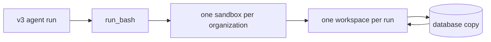

# v3 agent sandbox on main

The v3 agent gets a controlled place to run shell commands and work with
files. Each organization has one warm Modal sandbox. Each agent run gets its
own workspace inside it.

The Modal sandbox is temporary. Selected workspace files have a database copy,
so the service can restore them after a sandbox restart.

Source snapshot: `origin/main` at `de4f270f29a52d75befb4e4c9b1d9ceb3f360fcc`.
Source paths below were read from that ref.

## the basic shape

The pool reuses one network-blocked sandbox per organization. It names the
sandbox with the organization ID and image version
(`libraries/python/agent_sandbox/sandbox.py:270-298,336-425`).

Each run gets a separate directory. The path includes the organization, run,
mode, and a secret-derived token. This keeps runs and modes apart
(`libraries/python/agent_sandbox/workspace.py:28-43,98-131`).

The image is Debian slim with Python 3.13. It adds bubblewrap and basic command
tools such as `grep`, `jq`, `ripgrep`, and `sed`
(`libraries/python/agent_sandbox/sandbox.py:94-107,419-425`).

## limits

- A sandbox can live for 24 hours. It stops after one hour without use.
- Workspace records expire after 7 days.
- A command runs for 30 seconds by default. The agent can request 1 to 600 seconds.
- A command is at most 16,000 bytes.
- Each output stream is capped at 30,000 bytes.
- The Modal sandbox gets 0.5 CPU and 1,024 MiB of memory.
- Each command gets 60 CPU seconds, 512 MiB of memory, and 1,024 processes.
- At most 16 commands run across the service. At most 2 run for one organization.
- A durable workspace file is at most 10 MiB. One run can keep at most 100 MiB of durable files.

These values come from
`libraries/python/agent_sandbox/settings.py:25-42`,
`libraries/python/agent_sandbox/durable.py:32-35`, and
`libraries/python/agent_sandbox/workspace.py:15-18`.

## what the agent can do

`run_bash` runs one non-interactive bash command. It can inspect, create, and
transform files in `/workspace`. The command uses the current run's workspace
(`libraries/python/phoebe_v3_agent/tools/bash/tool.py:168-205`).

Large tool results are also placed in the workspace. Results over 500
characters, or results marked `to_sandbox`, become JSON, JSONL, or CSV files.
The agent receives a small preview and a `ws://` file reference
(`libraries/python/phoebe_v3_agent/middleware/workspace.py:96-131,253-260`).

The agent cannot use the sandbox to reach the internet or the database. The
sandbox receives no secrets. It also cannot install packages during a command,
because the network is blocked (`libraries/python/agent_sandbox/sandbox.py:336-356`).

## what happens to files

The working copy lives in the organization's warm sandbox. It can disappear
when Modal recycles that sandbox.

When the service writes a workspace file, it saves the database copy first.
The database row is scoped by organization, mode, run, and path. The file is
then written to the current sandbox
(`libraries/python/agent_sandbox/sandbox.py:635-768`,
`libraries/python/agent_sandbox/durable.py:296-379`).

The service durably stores spilled tool results and valid JSONL files found
after a successful, non-timeout bash command. The workspace index is metadata
and does not use the run's 100 MiB data budget
(`libraries/python/agent_sandbox/sandbox.py:1102-1198`,
`libraries/python/agent_sandbox/durable.py:305-312`).

Other scratch files are temporary. They are not a recovery guarantee unless a
service path publishes them. Bound user uploads are loaded again from the
attachment store during hydration
(`libraries/python/agent_sandbox/sandbox.py:1311-1352`).

After a recycle, the service creates the run directory and restores durable
files. It also restores the run's bound uploads. The agent keeps the same run
identity, but it must recreate scratch files
(`libraries/python/agent_sandbox/sandbox.py:1247-1352`).

Every five minutes, one cleanup worker checks for workspaces unused for 7 days.
It removes the warm directory, deletes the database rows, removes activity
metadata, and clears the local hydration cache
(`services/worker/handlers/system/workspace_cleanup.py:23-35`,
`libraries/python/agent_sandbox/sandbox.py:1408-1500`).

## when things go wrong

- A command timeout returns exit code `124`, `timed_out=true`, and a timeout message.
- CPU, memory, or process limits return a resource-limit result.
- Full command capacity returns `The bash sandbox is at capacity; retry shortly or continue without it.` The admission wait is 30 seconds.
- A conflicting operation on one workspace returns `workspace is busy; retry shortly`.
- A lost Redis lease cancels the active command. The agent must retry after the lease clears.
- A transient Modal `NotFoundError`, termination, or timeout causes one internal refresh, file restore, and command retry. A successful retry includes a sandbox notice.
- If the sandbox is disabled or its deployed credentials are missing, the agent receives a not-allowed error.

Output truncation is reported by `stdout_truncated` or `stderr_truncated`. The
command runner reports these states from
`libraries/python/agent_sandbox/exec.py:897-935` and
`libraries/python/agent_sandbox/budget.py:44-138`.

## why it is safe

Modal blocks network access when it creates the sandbox. Each command then
runs inside bubblewrap with separate namespaces and a private process view.
System directories are read-only. Only that run's directory is writable at
`/workspace`. `/tmp` is a bounded temporary filesystem
(`libraries/python/agent_sandbox/sandbox.py:336-356`,
`libraries/python/agent_sandbox/confinement.py:58-145`).

The command supervisor applies CPU, memory, and process limits. It kills the
command tree when the command times out, is cancelled, or reaches a resource
limit (`libraries/python/agent_sandbox/exec.py:398-708`).

Workspace paths must be relative. Path checks reject traversal, unsafe names,
symlinks, and oversized files. Database queries use organization, mode, run,
and path checks, plus database row security
(`libraries/python/agent_sandbox/workspace.py:64-95`,
`libraries/python/agent_sandbox/durable.py:305-419`).

## scope

This note covers the merged sandbox system at the snapshot above. For the
separate image decision, see [[v3-sandbox-single-image-decision]]. For the
in-flight design work outside this snapshot, see
[[v3-agent-modal-sandbox-design]].
