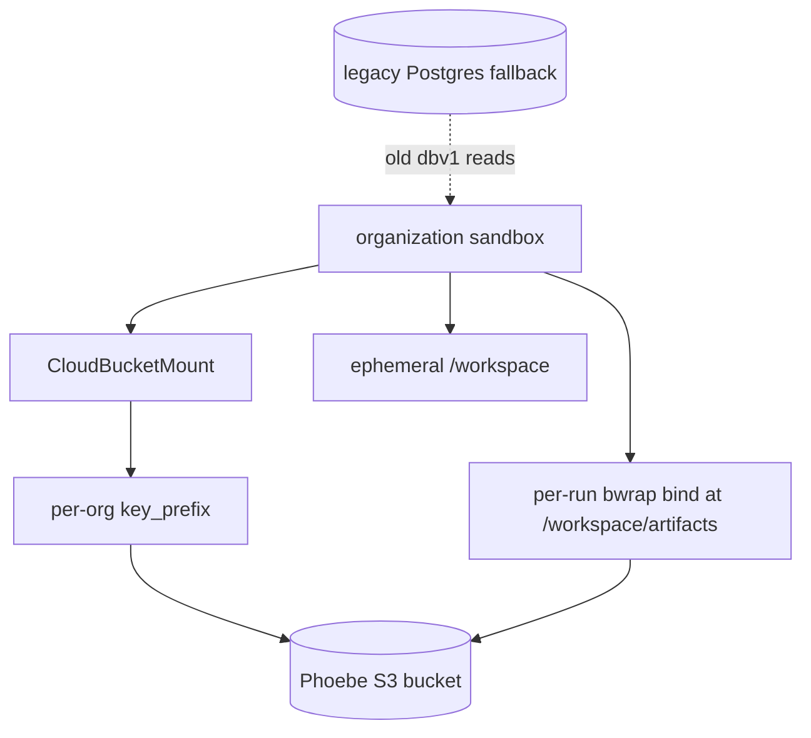

# v3 sandbox s3 artifacts: implemented design

This note records the implementation at PR #15530 for PHO-17054. The source
snapshot is `eaaf83c9a639108169c8b8c1b5a1fd11e63a7dfe`, from
`git -C /Users/henry/me/fun/phoebe/.worktrees/pho-17054-s3-artifacts rev-parse HEAD`.
The PR is open and its head is not merged.

## purpose

The old design copied workspace files between Modal and PostgreSQL. That sync
step created a second failure mode: a command could succeed while its durable
copy failed, or the reverse. PostgreSQL also became a poor home for large
artifact blobs in the OLTP database. PR #15530 stores durable artifacts by
location on an S3 mount, so a completed write is durable without a sync job.
PostgreSQL remains only as a bounded, temporary read fallback for old runs.

This is the implementation counterpart to
[[v3-sandbox-volume-artifacts-proposal]]. The proposal's two-mount direction
survived. The implementation refined it in four important ways:

- `CloudBucketMount` is durable by file location, but graceful termination can
  leave a torn object. An index entry and recorded byte size now define whether
  a path is real.
- Bash writes are discovered after a successful command by comparing a
  pre-command snapshot. Existing files do not become new receipts by accident.
- The flag keeps a bounded legacy hydration path during rollout. Mounted writes
  do not dual-write PostgreSQL.
- Quota recovery is a narrow, direct-argv `rm --` operation. It cannot resolve a
  model-controlled `/workspace/rm` executable.

## architecture

There is one warm Modal sandbox per organization. The sandbox runs with
`block_network=True`. Modal's runner creates the bucket mount outside the guest;
the guest receives no bucket credentials. Bubblewrap then gives each command
only its run directory and its artifact directory.



The organization pool creates the mount at `/data/artifacts` with
`key_prefix=agent-sandbox/<organization hex>/`. It creates the named sandbox
with the storage contract in its name: `-s3v1` for the mount and `-dbv1` for
the legacy layout (`libraries/python/agent_sandbox/sandbox.py:305-343,
404-421`). This prevents a warm sandbox from being reused across incompatible
storage contracts.

`/workspace` is still ephemeral scratch. In the mounted contract,
`/workspace/artifacts` binds the current run's S3-backed directory. The
per-command jail binds the run's local workspace and then separately binds the
artifact directory at `/workspace/artifacts`
(`libraries/python/agent_sandbox/confinement.py:76-175`). Recycling the warm
sandbox removes scratch but does not remove completed S3 objects.

## keys and scopes

The logical layout is:

```text
bucket/
  orgs/<org>/
    <run>-<mode>-<token>/
      tool_outputs/index.jsonl
      tool_outputs/0001_query.jsonl
      reports/result.csv
```

The implemented literal prefix is `agent-sandbox/<org hex>/`, not a literal
`orgs/` segment. Thus a real key is shaped like:

```text
<bucket>/agent-sandbox/<organization hex>/<run hex>-<mode>-<token>/tool_outputs/...
```

`RunWorkspace.run_name` supplies `<run>-<mode>-<token>`. The token is a
16-byte HMAC-derived value over organization, run, and mode. The path helpers
also reject unsafe segments (`libraries/python/agent_sandbox/workspace.py:30-57,
78-128`).

There are three independent scoping layers:

1. The mount prefix scopes the organization. The IAM role and
   `CloudBucketMount` both use the organization prefix.
2. The bwrap bind scopes a command to one run's directory. It cannot see the
   sibling run directories in the organization mount.
3. The HMAC directory token makes the run directory hard to guess, while the
   run id and mode keep references stable and mode-specific.

The artifact index uses `tool_outputs/index.jsonl`. Spilled tool output writes a
typed file and returns a bounded envelope with a `ws://` reference. The writer
lease covers reading and rewriting the index
(`libraries/python/phoebe_v3_agent/middleware/workspace.py:463-524`).

## torn objects and trusted reads

The invariant is simple: a durable path is addressable only after its index
entry exists with its byte size.

Publishers write the object first. They then append or rewrite the index under
the existing workspace writer lease. The entry records `path`, metadata, and
`size_bytes`; the index itself is rewritten as one complete file
(`libraries/python/agent_sandbox/sandbox.py:819-887`). This is write-then-index
ordering. It leaves a failed or interrupted object unindexed rather than
making it a trusted artifact.

For `run_bash`, the service snapshots regular artifact paths and sizes before
the command. It indexes only regular files that the successful command created
or resized. It ignores the index file itself and validates each candidate path
before rewriting the index (`libraries/python/agent_sandbox/sandbox.py:889-982,
2022-2088`). A failed or timed-out command does not publish its new files.

Every mounted read requires a matching index entry and a non-negative integer
size. A mismatch raises `WorkspaceArtifactIntegrityError`, which maps to an
integrity failure. A missing or malformed entry raises
`WorkspaceArtifactNotIndexedError`. Both fail closed
(`libraries/python/agent_sandbox/sandbox.py:1667-1731`). API-side S3 reads apply
the same index and exact-size check (`libraries/python/agent_sandbox/artifacts.py:84-191`).

During rollout, a mounted run may hydrate an old PostgreSQL row. A read may
accept the hydrated bytes only when they exactly match that legacy row. A
mounted S3 object without an index entry never becomes trusted through this
exception. The regression tests cover the torn and unindexed cases:

- `libraries/python/agent_sandbox/sandbox_test.py:1126-1220` — mounted torn
  and unindexed reads.
- `libraries/python/agent_sandbox/artifacts_test.py:70-181` — S3 size,
  torn-object, and unindexed-object reads.
- `libraries/python/agent_sandbox/sandbox_test.py:587-728` — successful-only
  bash indexing and failed-write rejection.
- `libraries/python/agent_sandbox/sandbox_test.py:1248-1308` — write order
  and index behavior.

## quotas and recovery

The mounted contract enforces two limits:

- 100 MiB per run by default (`AGENT_SANDBOX_MAX_ARTIFACT_BYTES`).
- 1 GiB across the organization's mounted artifact directories by default
  (`AGENT_SANDBOX_MAX_ORG_ARTIFACT_BYTES`).

The service measures both directories with `du -sb`. It checks before normal
writes and commands, after trusted writes, and after commands. A command also
gets a pre-command snapshot for indexing. Quota measurement failures fail
closed. A normal over-quota command returns exit code 122 and this explicit
model-facing text:

```text
Sandbox artifact quota exceeded: this run uses <bytes> bytes, over its <limit>-byte limit. Remove files under /workspace/artifacts and retry.
```

The organization form names the organization limit instead. The implementation
is in `libraries/python/agent_sandbox/sandbox.py:437-535, 1733-1856`.

The only recovery path is deletion. The classifier accepts `rm --` with at least
one operand. Each operand must be under `artifacts` or
`/workspace/artifacts`, must not start with `-`, and must not contain `.` or
`..`. It rejects shell syntax, flags, the artifact root itself, and every
other command shape (`libraries/python/agent_sandbox/sandbox.py:475-514`).
This is the trusted `rm` anchor. The service converts an accepted command to
direct argv. Bubblewrap sets
`PATH=/.direct-bin` and read-only binds `/usr/bin/rm` there. This prevents a
fake `/workspace/rm` from replacing the trusted binary
(`libraries/python/agent_sandbox/confinement.py:17-45, 93-175`).

The deletion path is deliberately not a general quota bypass. A command that
is already over quota may run only the trusted deletion operation. The
regression `test_over_quota_cleanup_allows_a_later_write` creates a fake
`/workspace/rm`, proves that the fake path is rejected, runs trusted `rm --`,
and then proves that a later write succeeds
(`libraries/python/agent_sandbox/sandbox_test.py:731-851`).

## rollout and legacy compatibility

The storage contract is versioned in the organization sandbox name. Complete
artifact settings select `s3v1`; incomplete or disabled settings select
`dbv1`. Settings require a bucket, region, the enabled flag, and exactly one of
the Modal secret reference or OIDC role ARN
(`libraries/python/agent_sandbox/settings.py:51-68, 146-157`).

The rollout order is:

1. Deploy contract-aware workers while the artifact flag stays disabled.
2. Set bucket and credential settings on all workers.
3. Enable the flag only after every worker understands `s3v1`.
4. Let new mounted writes go only to S3. Keep old PostgreSQL rows for reads.

Mounted preparation hydrates old dbv1 rows into local `/workspace` so bash and
service reads continue to work. Hydration is bounded to 10,000 files, 10 MiB
per file, and 100 MiB total. It checks decompression, shape, and recorded byte
size. Any limit or integrity failure is loud, not partial
(`libraries/python/agent_sandbox/durable.py:28-32, 395-455`; mounted
preparation at `libraries/python/agent_sandbox/sandbox.py:1516-1599`).

Disabled workers keep the legacy `/workspace/...` layout. They also map old
`/workspace/artifacts/...` references to the legacy local artifacts directory.
The mounted path uses `/workspace/artifacts/...` and never persists a new
write to PostgreSQL. The fallback is tested at
`libraries/python/agent_sandbox/sandbox_test.py:451-527, 919-1068`.

The PostgreSQL read fallback is time-bounded by the rollout and old-row age-out.
After all pre-mount rows age out, remove the fallback, legacy hydration, and
the `agent_run_workspace_files` persistence path. The table deletion needs its
normal pending-deletion migration, not an ad hoc drop.

## retention and cleanup

Retention follows the conversation, not a wall-clock TTL. S3 artifacts live
while the conversation that references them lives. The conversation reset or
deletion hook schedules deletion of each old run's artifact prefix after the
database transaction commits (`libraries/python/phoebe_event_agent/utils.py:68-136`).
`delete_run_artifacts` removes all mode-specific objects below the run prefix
in batches of 1,000 S3 objects
(`libraries/python/agent_sandbox/artifacts.py:221-262`).

The scheduled worker remains a safety net for orphaned run prefixes. It takes
one sorted prefix snapshot, slices it into batches of 500 run prefixes, and
uses one bounded `ANY` query per mode with at most 500 UUID binds. It then
deletes only prefixes whose run id has no database row
(`services/worker/handlers/system/workspace_cleanup.py:30-80`). For a
10,000-prefix snapshot, the R3 evidence is at most 20 prefix batches and at
most 40 bounded existence queries. There is no unbounded `ANY` bind and no
full-table scan in this path. The fixed snapshot also gives stable batch
membership while database checks run.

The Terraform lifecycle rule aborts incomplete multipart uploads after one day.
It does not expire completed artifacts. Conversation deletion and the orphan
sweep own completed-object deletion
(`terraform/modules/agent_sandbox_artifacts/main.tf:53-64`).

## settings and infrastructure

Unconfigured mode is fail-safe. The mount is enabled only when the settings
are complete and exactly one credential method is present. Missing settings
produce the legacy path while the flag is off. In deployed environments,
missing core Modal credentials raise a configuration error. The code logs a
warning during configuration checks and never mounts a partially configured
bucket (`libraries/python/agent_sandbox/settings.py:109-157`).

The Terraform module creates:

- a private, owner-enforced S3 bucket with public access blocked;
- default SSE-KMS encryption, key rotation, and a Phoebe-owned KMS key;
- a Modal OIDC provider and a role restricted to the configured Modal
  workspace;
- list, multipart, object, and KMS permissions under `agent-sandbox/*`;
- access logging when enabled and a deny-insecure-transport bucket policy.

`s3:GetBucketLocation` is unconditional. Prefix conditions apply only to list
actions. The mount role has only `kms:Decrypt` and `kms:GenerateDataKey` for
the artifact key. These details prevent the common Mountpoint startup failure
caused by putting bucket-location access behind a prefix condition
(`terraform/modules/agent_sandbox_artifacts/main.tf:101-181`). Staging and
production wire the module bucket, region, OIDC role, and disabled-by-default
flag into worker settings (`terraform/accounts/staging/main.tf:1451-1457,
2050-2055`; `terraform/accounts/production/main.tf:1572-1578,
2114-2119`).

Before production, a human still needs to apply the Terraform module, set the
real Modal workspace id, and provision or validate OIDC trust and credentials.
The PR leaves the enable flag false for this reason.

## review-hardening rationale

Five review rounds reduced the finding count from 8 to 3 to 2 to 1 to 0.
The survivors forced narrow invariants rather than a second storage layer.

| round | findings | survivor lesson |
| --- | ---: | --- |
| 1 | 8 | S3 durability needs an explicit index contract, exact sizes, rollout versioning, quotas, and cleanup ownership. |
| 2 | 3 | Path normalization, legacy compatibility, and API reads must use the same run and mode scope. |
| 3 | 2 | Operational bounds matter: hydrate old rows with hard limits and sweep a fixed 500-prefix snapshot. The R3 evidence gives at most 40 bounded existence queries for 10,000 prefixes. |
| 4 | 1 | Quota recovery is a security boundary. Classify `rm --` before execution and bind the system binary into a separate direct-bin path. |
| 5 | 0 | The final shape is sufficient with the existing writer lease and whole-index rewrite. No dual-write layer, hydration cache, or new storage abstraction is needed. |

## follow-ups

- Remove the PostgreSQL read fallback and retire the old workspace table after
  pre-mount rows age out. Add the table to the pending-deletion manifest first.
- PHO-17055: move chat artifacts to S3 with `CopyObject`. The current PR keeps
  chat attachment bytes in their existing attachment store.

Related decisions: [[v3-sandbox-single-image-decision]],
[[v3-agent-modal-sandbox-design]], and [[v3-agent-sandbox-on-main]].
