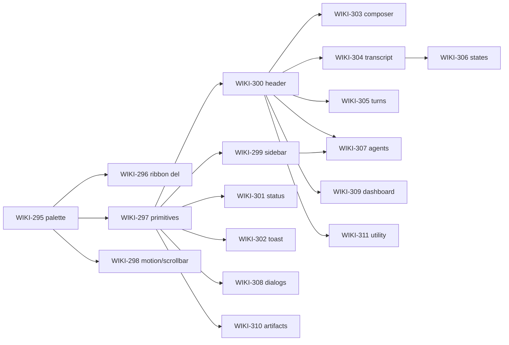

# bb one-to-one UI parity census (WIKI-294)

Authoritative surface-by-surface parity map between bb (github.com/get-bb/bb, "the agent IDE that builds itself") and Wiki.app, plus a ticket decomposition for the implementation workers.

- bb reference: `/tmp/bb-reference` (git checkout, read-only).
- wiki source: `/Users/henry/me/fun/wiki/frontend/src` (read-only for this planner).
- Prior art: `vault/wiki/polish-census.md` (WIKI-150 rubric and surface list), `vault/meta/wiki-app-ui-direction.md` (Obsidian-parity behaviors that must survive).
- Baseline: WIKI-293 ported the shell tokens (soft canvas, rounded panel, hairlines, composer card, chip status bar). See `frontend/src/styles.css:127-145` (token block) and `frontend/src/styles.css:16362-16650` (reskin layer). Everything below assumes WIKI-293 is already merged.

Scope this program covers (from Henry's brief): make the wiki app UI a near one-to-one copy of bb, with wiki-native surfaces restyled in bb's language. Structural DOM/markup changes ARE in scope this round (they were not in WIKI-293). Behavior, routing, and state changes stay out of scope unless a markup restructure forces a mechanical adjustment.

---

## 1. bb design-language extraction

### 1.1 Layout regions

Three-column app shell, top-mounted title-bar row, one rounded scroll container per column.

- Shell: `/tmp/bb-reference/apps/app/src/components/layout/AppLayout.tsx:1-460` composes `SidebarProvider` + `SidebarInset` + a resizable `SecondaryPanelLayout`.
- Left sidebar: `AppLayoutSidebar.tsx` mounts `AppSidebar.tsx:1-120`. Width persisted in `localStorage["bb.sidebar.width"]`, clamped 240..460, default 320 (`AppLayout.tsx:97-119`).
- Center pane: `SidebarInset` holds `AppPageHeader` (`components/layout/AppPageHeader.tsx:1-80`) + thread body (`views/thread-detail/`).
- Right pane ("Dispatch" in the screenshot): `components/secondary-panel/SecondaryPanelLayout.tsx:33-73`. Resizable via `react-resizable-panels`; default main 70% / secondary 30%; min main 30%.
- Every column is scrolled from its own inner container; the app root sets `overflow: hidden` + `height: 100dvh` (`apps/app/src/app.css:1-70`).
- Chrome row shared between sidebar + header: `CHROME_ROW_CLASS` (`components/layout/AppLayout.tsx:236,266`) — one seam class `border-b border-border-seam-vertical/60` (`AppPageHeader.tsx:52`).
- No visible ribbon column. Icon navigation lives in the sidebar's own sections (Inbox / Tasks / Automations / etc.) plus a footer row.

Wiki delta: wiki has a hard 44px vertical ribbon (`App.tsx:3720`) that bb does not. Ribbon has to fold into the sidebar as icon sections + a footer row.

### 1.2 Navigation model

- Left sidebar owns three tiers: (1) global destinations (Inbox, Automations, Skills, Plugins, Tasks — see `sidebar/BuiltInSidebarSection.tsx`), (2) per-project thread groups (`sidebar/ProjectList.tsx`, `sidebar/ProjectRow.tsx`), (3) pinned threads (`sidebar/PinnedThreadTree.tsx`).
- Sticky tier system pins section labels + project rows + parent-thread rows as you scroll (`theme.css:130-390`). Depth-driven z-index, one shared padding token.
- Top of the sidebar owns "chrome row" alignment with the traffic lights on macOS desktop chrome (`components/layout/AppLayoutSidebar.tsx`).
- Center page has `AppPageHeader` with `center` (breadcrumb) + `actions` slots, no title-only bar. Breadcrumb is a `<nav aria-label="Breadcrumb">` (`AppBreadcrumbs.tsx:1-60`), semi-bold, chevron separator.
- Right ("dispatch") panel is a tabbed side panel: `NewTabPage`, `BrowserTabDeck`, `FilePreview`, `GitDiffCard`. Panel is toggled from the header; tab strip is inside the panel.
- Composer is bottom-anchored inside the center pane, not in a status rail (`components/promptbox/NewThreadPromptBox.tsx`, `FollowUpPromptBox.tsx`).
- Status rail is minimal or absent; the sidebar footer owns app-level toggles (`SidebarFooter` in `AppSidebar.tsx`).

### 1.3 Typography scale

- Sans: `"Inter Variable", Inter, sans-serif` — `theme.css:549`.
- Serif: `Georgia, serif` — `theme.css:550`.
- Mono: `"Fira Code", monospace` — `theme.css:551`.
- Base sizes (desktop): `--text-sm: 0.8125rem` (~13px), `--text-base: 0.9375rem` (~15px, line-height 1.375rem), `--text-2xs: 0.625rem` (~10px chrome) — `theme.css:96-104`.
- Coarse-pointer bump at ≤767px: `--text-sm: 0.9375rem`, `--text-base: 1rem` — `theme.css:106-118`.
- Body copy weight 400; chip labels use `font-medium` (500) and section headers `font-semibold` (600); no display weight above 600.
- `text-2xs` is chrome-only (unread divider, count chips, ids) and never paired below `--subtle-foreground`.
- Numeric-heavy chips wear `tabular-nums`.

### 1.4 Spacing system

- Grid unit: `--spacing: 0.25rem` (4px) — `theme.css:578`. Tailwind's default `spacing` scale collapses onto this token.
- Sidebar row height: `--bb-sidebar-row-height: 1.75rem` (28px), coarse: 2.5rem (40px) — `theme.css:553-554`.
- Sticky-stack padding: `--bb-sidebar-sticky-stack-padding: 0.5rem` (8px), sticky label height 1.5rem, sticky row gap 4px — `theme.css:134-160`.
- Chrome row height comes from `CHROME_ROW_HEIGHT_CLASS` (`bb-desktop.ts`) — matches the traffic-light footprint.
- Resource shelf gap contract: shelf-inset 12px, section-gap 8px, label-gap 6px, item-gap 4px, item-width 31.25% — `theme.css:581-591`.
- Card/menu content padding is `p-1.5` (6px) on menu containers and `px-2` (8px) on list rows (see `PaneMaximizeButton.tsx:121`, `AppBreadcrumbs.tsx:34`).

### 1.5 Color system

Both themes anchor on two variables — `--canvas` and `--ink` — with every neutral surface derived by `color-mix(in oklch, var(--ink) N%, var(--canvas))`. Elevation is border + shadow, not tint. Palette values are excerpted directly from `apps/app/src/components/ui/theme.css:392-780`.

Light (`:root, .light`):

| token | value | notes |
|---|---|---|
| `--canvas` | `oklch(1 0 0)` | pure white |
| `--ink` | `oklch(0.3211 0 0)` | deep neutral |
| `--card`, `--popover` | `var(--canvas)` | flush with page |
| `--primary` | `oklch(0.27 0 0)` | near-black CTA |
| `--secondary`, `--accent` | `ink 8% / canvas` | one low-emphasis fill |
| `--muted` | `ink 11% / canvas` | |
| `--muted-foreground` | `oklch(0.44 0 0)` | ~7.4:1 |
| `--subtle-foreground` | `oklch(0.5 0 0)` | ~5.9:1 |
| `--readback-foreground` | `oklch(0.47 0 0)` | between muted + subtle |
| `--border` | `ink 14% / canvas` | |
| `--border-hairline` | `ink 14.7% / canvas` | |
| `--border-seam` | `ink 9.5% / canvas` | app-shell seam |
| `--input` | `ink 29.5% / canvas` | |
| `--ring` | `var(--primary)` | achromatic focus |
| `--state-hover` | `ink 5.9% / transparent` | translucent |
| `--state-active` | `ink 11.8% / transparent` | translucent |
| `--surface-recessed` | `ink 6% / transparent` | |
| `--surface-raised` | `ink 2.5% / transparent` | |
| `--surface-selected` | `primary 16% / transparent` | |
| `--sidebar` | `ink 2.2% / canvas` | subtly recessed from page |
| `--destructive` | `oklch(0.45 0.19 25.86)` | one of the two chromatic exceptions |
| `--attention` | `oklch(0.74 0.15 80)` | amber |
| `--warning` | `oklch(0.7 0.16 50)` | |
| `--success` | `oklch(0.7 0.15 155)` | |
| `--timeline-accent` | `oklch(0.55 0.10 250)` | soft "paper blue" — the only tint in the timeline |
| `--pr-merged` | `oklch(0.53 0.20 295)` | github merged-purple |
| `--diff-added` | `oklch(0.4 0.13 163)` | |
| `--diff-removed` | `oklch(0.4 0.17 28)` | |
| `--sidebar-search-match` | `oklch(0.8 0.13 88) 24% / canvas` in oklab | manilla tint |

Dark (`.dark`):

| token | value | notes |
|---|---|---|
| `--canvas` | `oklch(0.195 0 0)` | near-black, off-black |
| `--ink` | `oklch(0.81 0 0)` | softened from pure white |
| `--primary` | `oklch(0.82 0 0)` | near-white CTA |
| `--secondary`, `--accent` | `ink 13% / canvas` | steps enlarged for dark |
| `--muted` | `ink 16% / canvas` | |
| `--muted-foreground` | `oklch(0.78 0 0)` | |
| `--subtle-foreground` | `oklch(0.68 0 0)` | |
| `--border` | `ink 19.4% / canvas` | |
| `--border-hairline` | `ink 21% / canvas` | |
| `--border-seam` | `ink 11% / canvas` | |
| `--sidebar` | `ink 4.3% / canvas` | one step lifted |
| `--destructive-text` | `oklch(0.65 0.16 22)` | clears AA on dark |
| `--timeline-accent` | `oklch(0.72 0.09 250)` | lifted for dark |

Radius: `--radius: 0.5rem` (8px), with `sm`/`md`/`lg`/`xl` derived (`theme.css:80-83`).

Shadows: one master pair — 2px flat "press" shadow + a soft blur — always on top-anchored surfaces. Composer uses `--shadow-lift` (upward-cast): `0px -4px 12px -4px hsl(0 0% 20% / 0.07)` (`theme.css:571`). No colored shadows.

### 1.6 Component inventory

All primitives live in `apps/app/src/components/ui/` unless noted. Sourced from shadcn/ui with local extensions; class layer is Tailwind v4.

| primitive | file | shape notes |
|---|---|---|
| Button | `@bb/shared-ui/button` (see `button.stories.tsx:1-70`) | variants default/secondary/outline/ghost/destructive/link; sizes sm/default/lg/icon; radius `--radius-md`; icon-first supported |
| Icon button | `HEADER_ICON_BUTTON_CLASS`, `HEADER_REDUCED_GLYPH_ICON_BUTTON_CLASS` (`AppPageHeader.tsx:28-45`) | fixed square hit boxes shared across header + pane maximize/close (`PaneMaximizeButton.tsx:38-90`) |
| Chip / tab-pill | `tab-pill.tsx` | rounded-full, `text-xs`, muted-foreground default, foreground when active |
| Pill (mention) | `.prompt-mention-pill` (`app.css:107-160`) | gradient surface via `--pill-surface`, `--pill-shadow`, hairline border |
| Card / detail card | `detail-card.tsx` | `border-border` + `bg-card`, `rounded-lg` |
| Split button | `split-button.tsx` | primary + menu with divider hairline |
| Dialog | `@bb/shared-ui/dialog` — see `dialog.browser-dimming.test.tsx` | scrim `--surface-scrim` (`--canvas 92%`); `rounded-xl` panel; centered, `max-w-lg` |
| Sidebar rail | `@bb/shared-ui/sidebar` (used from `AppSidebar.tsx:9-20`) | provides `Sidebar`, `SidebarContent`, `SidebarMenu`, `SidebarMenuButton`, `SidebarMenuItem`; row height comes from `--bb-sidebar-row-height` |
| Menu row | `MENU_ITEM_CLASS` (`PaneMaximizeButton.tsx:121-134`) | `rounded-md`, hover `bg-state-hover`, keyboard shortcut in `text-subtle-foreground` |
| Composer / PromptBox | `components/promptbox/PromptBoxInternal.tsx`, `NewThreadPromptBox.tsx`, `FollowUpPromptBox.tsx` | ProseMirror editor with mention pills, bottom-anchored, `--shadow-lift`, quiet fill + focus ring, dark circular send |
| Thread / timeline | `views/thread-detail/`, `components/thread/timeline/` | left rail with `--timeline-accent`, quiet borders, per-turn envelope |
| Task board (right panel) | `components/secondary-panel/NewTabPage.tsx`, `BrowserTabDeck.tsx` | tabbed panel with `SECONDARY_PANEL_TOP_CHROME_BACKGROUND_CLASS = "bg-sidebar"` |
| Diff card | `components/secondary-panel/DiffFileCard.tsx`, `DiffFilesPanel.tsx` | inline diff, `--diff-added` / `--diff-removed` |
| Breadcrumb | `AppBreadcrumbs.tsx:11-60` | semi-bold, chevron separator, first segment muted, last segment foreground |
| Toast | `sonner.tsx`, `app-toast.tsx` | one line + description, subtle border, `--shadow-md` |
| Scrollbar | overridden globally (`app.css:63-90`) | thin, `color-mix(in oklab, --foreground 20%, transparent)` thumb; `bg-transparent` track |

### 1.7 Motion

- One transition family. `transition-property: background-color, color`, `transition-duration: 120ms`, `transition-timing-function: cubic-bezier(0.2, 0, 0, 1)` — see WIKI-293 already ported into `styles.css:16400-16403,16437-16438`.
- Row swaps (icon rest → hover) do opacity only, both glyphs share one grid cell so the row never reflows mid-swap (`theme.css:225-267`).
- No page-load stagger; entrances are opacity-only.
- Respects `prefers-reduced-motion` (`styles.css:16336-16344`).
- Sidebar drag cursor is pinned via `body[data-sidebar-dragging="true"]` (`app.css:97-103`).

### 1.8 Iconography

- Icon set: bb ships its own `Icon` component (`@bb/shared-ui/icon`) with named glyphs (`ChevronRight`, `Plus`, `Check`, `ArrowRight`, `Message`, `Task`, `Cog`, …). Stroke width global: `--icon-stroke-width: 1.75` (`theme.css:592`).
- Sizes: `size-3.5` (14px) for breadcrumb chevrons, `size-4` (16px) default inline, `size-5` (20px) for surface headers. Header controls share `HEADER_ICON_BUTTON_CLASS`.
- No colored icons; every icon inherits `currentColor`. State color is on the row, not the glyph.

---

## 2. Surface-by-surface mapping

Rubric: 1 = still wiki-native visually, 5 = one-to-one with bb. Deltas describe what the implementer must change.

Numbering follows the WIKI-150 census surface order; wiki-native surfaces built since (multi-pane grid, tmux status strip, agent session surface, kanban, graph, health, tokens, dashboard, artifact panel, command palette, quick/fleet switchers) are appended.

### 2.1 Global chrome

| # | wiki surface | wiki file(s) | bb equivalent | bb file(s) | parity | delta |
|---|---|---|---|---|---|---|
| G1 | 44px vertical ribbon (nav + theme + more) | `App.tsx:3720`, `styles.css:16386-16407` | none — bb has no ribbon | destinations live in `AppSidebar.tsx` sections and `SidebarFooter`; theme toggle in Settings | 2 | Fold destinations into a `SidebarMenu` "Views" section at sidebar top; move theme/settings into a `SidebarFooter` icon row; delete ribbon column, collapse `.app-container` to `[sidebar] [main] [right?]` |
| G2 | Left sidebar shell (workspace selector + files/search/agents modes) | `App.tsx:3847`, `styles.css:16410-16445` | `AppSidebar.tsx:1-120` + `SectionSidebar.tsx` + `SidebarContent` | | 3 | Add sidebar chrome row (top drag region), one persistent width persisted like bb; adopt `SidebarProvider`-style resizable behavior via a divider handle; replace mode toggle with sidebar sections (Files / Search / Agents / Views collapsible groups) |
| G3 | Center pane rounded panel (holds tabs + view header + panes + status bar) | `App.tsx:4053`, `styles.css:16449-16455` | `SidebarInset` + `AppPageHeader` + main body; no rounded outer panel — bb bleeds the center to the window edge inside its shell | | 4 | Panel is already rounded per WIKI-293. Delta: check that bb's "flush edge" reading holds — Henry's WIKI-293 direction kept the rounded panel deliberately. Ruling needed (see §3) |
| G4 | Top tab header (tab title strip) | `App.tsx:3691-3720` (WIKI-150), current `App.tsx:4054-4106` | `AppPageHeader` (`AppPageHeader.tsx:57-120`) + `AppBreadcrumbs.tsx` | | 2 | Replace tab title strip with `AppPageHeader` shape: left = sidebar trigger + breadcrumb, right = action slot (kebab, panel toggle). Preserve tab semantics only for wiki-native windows (see §3 conflict W1) |
| G5 | View actions (icons next to title) | `App.tsx:4058+`, `styles.css:16474-16481` | `AppPageHeader` actions slot; icon buttons use `HEADER_ICON_BUTTON_CLASS` | `AppPageHeader.tsx:28-45` | 3 | Adopt shared icon-button size; gap 2px stays; move all icons into `actions` slot |
| G6 | Bottom status bar / tmux window strip | `App.tsx:4168`, `styles.css:16589-16636` | none — bb has no window strip; `SidebarFooter` owns app-level chrome | | 2 | Two options (see §3 W2): (a) preserve status bar as wiki-native but restyle chips to bb's tab-pill grammar; (b) move tmux window switching into a sidebar section. Recommend (a). |
| G7 | Global notice / banner strip | `App.tsx:3744` | Toast via `sonner.tsx` + inline `AppErrorBoundary.tsx` | | 3 | Move recoverable errors into toasts using bb's `Sonner`; keep only persistent unrecoverable states as inline banners styled as `Alert` (`ui/alert.tsx` if it exists — otherwise a `detail-card` w/ `--destructive-text`) |

### 2.2 Notes / files / workspace views

| # | wiki surface | wiki file(s) | bb equivalent | parity | delta |
|---|---|---|---|---|---|
| N1 | File explorer tree | `App.tsx:3607`, `styles.css:16427-16445` | `sidebar/ProjectList.tsx` + `PinnedThreadTree.tsx` + sticky-stack (`theme.css:130-390`) | 3 | Adopt sticky section labels + parent-row pinning; use bb's row height token (28px, coarse 40px); use `bb-sidebar-hover-actions` pattern (`theme.css:225-263`) for row-hover kebab; row selection uses `--surface-selected` |
| N2 | Workspace selector | `App.tsx:3901` | bb has no workspace switcher — project rows serve; nearest analog: `ProjectRow.stories.tsx` | 2 | Restyle to a `ProjectRow`-shaped opener: leading folder icon, semi-bold label, muted secondary path, kebab on hover; keep behavior |
| N3 | Search panel | `App.tsx:3645` | Sidebar search via `useSidebarThreadSearch.ts` — inline in the sidebar, not a separate mode | 3 | Convert to inline search field at sidebar top (persistent, not a mode); result list uses same row shape; keep highlight token (search-match manilla tint above) |
| N4 | Note reading view | `pane.tsx:357`, `markdown.tsx` | bb thread body uses `markdown-preview.tsx` + timeline; no reading pane equivalent (bb is agent-only) | 4 | Keep Obsidian markdown behaviors (conflict W3). Restyle heading rhythm to bb's — `--text-base` 15px body, generous line-height 1.375rem, `Georgia` serif for prose headings if we adopt bb's serif fallback |
| N5 | Metadata / frontmatter properties | `pane.tsx:361` | none direct — bb has thread metadata rows in `AppLayout` header | 3 | Convert pill radius to `--radius-md`; label color `--muted-foreground` |
| N6 | Source editor / new note | `App.tsx:3288`, `source-editor.tsx` | `NewThreadPromptBox.tsx` conceptually — bb has no filename input, but PromptBox card shape applies | 3 | Wrap textarea in a `detail-card`-shaped card with hairline border; move filename input into card header row |
| N7 | Kanban board | `kanban.tsx:173,246` | none native — bb has a Tasks section in the right dispatch panel (`components/secondary-panel/NewTabPage.tsx` + task rows) | 2 | Restyle cards as `detail-card`; lane header uses semi-bold `text-sm` + count chip; add card in each lane uses bb ghost-button; keep drag |
| N8 | Backlinks section | `pane.tsx:398` | none direct | 4 | Restyle header as `text-2xs uppercase tracking-wider text-subtle-foreground` (bb section-label grammar); rows share tree-row shape |
| N9 | Code file pane | `code-file-pane.tsx:124` | `git-diff/` renderers + `event-code-block.tsx` | 3 | Adopt `markdown-code-highlight.css` palette; use `copy-button.tsx` shape for the copy control |
| N10 | Terminal pane | `terminal-pane.tsx:155` | `components/thread/terminal/` | 3 | Header row uses `AppPageHeader` shape; connection state chip uses bb tab-pill |

### 2.3 Chat / transcript

| # | wiki surface | wiki file(s) | bb equivalent | parity | delta |
|---|---|---|---|---|---|
| C1 | User message | `session.tsx:1458` | `packages/thread-view/src/timeline-*` + `views/thread-detail/` renderers | 3 | Right-align stays; adopt bb's turn envelope — mention pills as `.prompt-mention-pill` (`app.css:107-160`), body inside a subtly-recessed card |
| C2 | Assistant message | `session.tsx:1509` | thread-view assistant projection (`packages/thread-view/src/assistant-*`) | 3 | Full-width prose; no card. Add left rail using `--timeline-accent` for streaming/pending state only |
| C3 | Tool call row | `session.tsx:972,1674` | tool activity via `packages/thread-view/src/tool-activity-*` | 2 | Adopt bb's compact activity row grammar: icon + verb + target + `chevron-down` (see `components/ui/activity-row-styles.ts` for the shared row class). Expansion body uses `event-code-block.tsx` |
| C4 | Bash / tool output block | `session.tsx:1182` | `event-code-block.tsx` + `expandable-line.tsx` | 2 | Use `expandable-line.tsx` for preview + expand; adopt bb's peek row (top N lines, byte count on the right, copy on hover) |
| C5 | System / hook / marker messages | `session.tsx:1270,1475` | timeline noise + info rows (`packages/thread-view/src/timeline-noise-events.ts`) | 3 | Adopt bb's info-row shape: `text-2xs uppercase` label + one-line body, `text-subtle-foreground` |
| C6 | Provider action-required card | `session.tsx:405` | `pending-interactions/` in `components/thread/` | 3 | Wrap as `detail-card` with primary CTA using bb `Button` `default` variant, dismiss using `ghost` |
| C7 | Loading / streaming state | `session.tsx:2363,3309` | thinking + stream projections (`packages/thread-view/src/reasoning-lifecycle-projection.ts`, `assistant-stream-projection.ts`) | 3 | Anchor at transcript tail; use bb's timeline-accent dot pulse |
| C8 | Error message | `session.tsx:2363,3172` | `error-display.ts` + `parse-error-message.ts` (thread-view) | 3 | Restyle as `--surface-destructive` card + `--destructive-text` |
| C9 | Empty session state | `session.tsx:2384` | `RootComposeEmptyWelcome.tsx` | 2 | Adopt bb's empty-thread welcome shape: centered composer + suggestion chips |
| C10 | Timestamps | `timestamp.tsx:52`, `session.tsx:1619` | `format-timeline-text.ts` | 4 | Keep sparse; use `--subtle-foreground`, tabular-nums, hover for absolute |
| C11 | Model / format / disposition footer | `session.tsx:2380,2463` | `SessionModelFooter` analog in `PromptBox` — bb shows model in composer footer only | 2 | Delete diagnostic footer; move model switcher into composer footer |

### 2.4 Agent management

| # | wiki surface | wiki file(s) | bb equivalent | parity | delta |
|---|---|---|---|---|---|
| A1 | Agents page toolbar / hierarchy | `agents.tsx:1355,1217` | bb has no "runs" page — dispatch happens per-thread; nearest: `NewTabPage.tsx` + `BrowserTabDeck.tsx` | 2 | Restyle as bb page: `AppPageHeader` with breadcrumb "Runs" + primary "Start run" button; body is a two-column split (active vs history) using `resource-list` primitives |
| A2 | Live worker card | `agents.tsx:1082` | `ProjectRow.tsx` + activity-row-styles | 2 | Convert to compact row (title / state chip / relative time / kebab); move technical details into an inline `disclosure.tsx` |
| A3 | Archived run card | `agents.tsx:1293` | same activity-row shape, muted | 3 | Same row shape as A2 with `--readback-foreground` and no kebab |
| A4 | Account / auth banner | `agents.tsx:730` | `AppToaster.tsx` + `app-toast-descriptions.tsx` | 2 | Move into `Sonner` toast for transient; persistent auth-required uses `Alert`-shaped inline card |
| A5 | Lifecycle controls | `agents.tsx:1014` | `ExecutionControls.tsx` + `ThreadActionsMenu.tsx` | 3 | One primary `Button` (context-sensitive) + kebab menu (`DropdownMenu` shape, `MENU_ITEM_CLASS`); destructive uses `ghost` with `--destructive-text` |
| A6 | Session preview sidebar | `session.tsx:3393` | `SecondaryPanelLayout.tsx` with `FilePreview.tsx` shape | 3 | Wrap preview in secondary-panel chrome: `bg-sidebar` header, tab strip, close in top-right |
| A7 | PR review panel | `agent-pr-review.tsx:115` | `git-diff/` panel + `DiffFilesPanel.tsx` | 4 | Adopt `DiffFileCard` shape for file rows; use bb's `pr-merged` purple for the merged state pip |

### 2.5 Dashboard

| # | wiki surface | wiki file(s) | bb equivalent | parity | delta |
|---|---|---|---|---|---|
| D1 | Tickets grid | `dashboard.tsx:144` | no native equivalent — nearest: `resource-list` in shared-ui | 3 | Convert to shadcn table shape used by bb settings pages (see `views/SettingsView.tsx`); rows use `--surface-selected` on hover |
| D2 | PR / worker / status row | `dashboard.tsx:196,205` | activity-row-styles | 3 | Use bb `Badge` shape for status chips; row shape identical to activity rows |
| D3 | Empty / loading / filters | `dashboard.tsx:171,236` | bb `Skeleton` primitive + `resource-pagination` | 3 | Add table-shaped skeleton; filter row uses bb `Select` + `Button` |

### 2.6 Session list (sidebar)

| # | wiki surface | wiki file(s) | bb equivalent | parity | delta |
|---|---|---|---|---|---|
| S1 | Session row | `agents.tsx:1562` | `ProjectRow.tsx` + sticky-tree | 3 | Adopt bb row anatomy; icon + label + `text-2xs` state + `bb-sidebar-hover-actions` kebab |
| S2 | Unread indicator | `agents.tsx:1562` | `SidebarUpdatesBadge` | 3 | Adopt count chip shape from bb, `text-2xs`, `--surface-selected` background |
| S3 | Grouping / sort headers | `agents.tsx:1577` | sticky section-label tier (`theme.css:280-300`) | 3 | Section labels become sticky, `text-2xs uppercase tracking-wider` |

### 2.7 Artifacts

| # | wiki surface | wiki file(s) | bb equivalent | parity | delta |
|---|---|---|---|---|---|
| AR1 | Artifact list / transcript block | `artifact-block.tsx:870` | `detail-card.tsx` + `event-code-block.tsx` | 3 | Restyle header row: icon + title + `text-2xs` type chip; drop the tinted header background; hover reveals actions |
| AR2 | Artifact viewer chrome | `artifact-panel.tsx:83` | `secondary-panel/BrowserTabDeck.tsx` + tab-pill | 2 | Convert to secondary-panel: sticky tab strip using `tab-pill.tsx`, close at right, no fake "coming soon" controls |
| AR3 | Table renderer | `artifact-detail/table.tsx:88` | bb shadcn `Table` | 4 | Adopt bb table typography (`--text-sm`) + row hover token |
| AR4 | Mermaid / SVG / plot / image renderers | `artifact-block.tsx:210,258,304,428` | `markdown-mermaid-diagram.tsx` + `image-lightbox.tsx` | 3 | Loading skeleton uses bb Skeleton; failure uses `--surface-destructive` card + Details disclosure |
| AR5 | Code renderer | `artifact-detail/code.tsx:105` | `event-code-block.tsx` + `markdown-code-highlight.css` | 3 | Adopt bb code palette; copy button uses `copy-button.tsx` shape; fold gutter matches bb line-number gutter |
| AR6 | Diff renderer | `artifact-detail/diff.tsx` | `git-diff/` + `DiffFileCard.tsx` | 4 | Palette bridging is already in bb theme (`--diffs-*` variables, `theme.css:635-638`) — mirror those tokens in wiki `themes.css` |
| AR7 | Artifact inspector | `artifact-block.tsx:941` | `disclosure.tsx` with structured rows | 2 | Convert JSON dump into structured rows; raw JSON behind a second explicit "View raw event" |

### 2.8 Command palette / switchers

| # | wiki surface | wiki file(s) | bb equivalent | parity | delta |
|---|---|---|---|---|---|
| CP1 | Command palette | `command-palette.tsx` | shadcn `Command` + `AppCommandProvider` (`components/commands/`) | 3 | Adopt bb `Command` shape: rounded-xl dialog, hairline groups, `text-2xs` group labels; keyboard shortcut chips right-aligned |
| CP2 | Quick switcher | `switcher.tsx:398` | same `Command` primitive with `useSidebarThreadSearch` | 3 | Same as CP1 |
| CP3 | Fleet switcher | `switcher.tsx:489` | `sidebar/ProjectList.tsx` open-menu | 3 | Row shape aligns to sidebar row |

### 2.9 Utility pages

| # | wiki surface | wiki file(s) | bb equivalent | parity | delta |
|---|---|---|---|---|---|
| U1 | Activity feed | `activity.tsx:61` | bb has no vault-activity view — nearest: `resource-list` + day groups | 2 | Convert commit rows to `activity-row-styles` shape; day heading uses sticky section-label |
| U2 | Graph view | `graph.tsx:440` | none native | 1 | Wrap canvas in `detail-card`; add legend + companion list using sidebar row shape (see §3 conflict W4) |
| U3 | Vault health | `health.tsx:55` | none native | 2 | Convert freshness buckets to `detail-card` grid + `Badge` chips |
| U4 | Token usage | `tokens.tsx:93` | bb has no token page; nearest: settings analytics rows | 2 | Convert chart wrapper to `detail-card`; skeleton uses bb Skeleton |

### 2.10 Modals / menus

| # | wiki surface | wiki file(s) | bb equivalent | parity | delta |
|---|---|---|---|---|---|
| M1 | Settings modal | `settings.tsx:713` | `views/SettingsView.tsx` + `components/dialogs/` | 2 | Convert to bb `Dialog` shape: `rounded-xl`, `max-w-2xl`, left rail with sections, right content pane, sticky footer for save/cancel |
| M2 | Spawn worker / orchestrator dialogs | `agents.tsx:250,526` | `ProjectPathDialog.tsx` + dialog family | 2 | Same dialog shape as M1; group Advanced fields into `disclosure.tsx` |
| M3 | Replace dialog | `replace-agent-modal.tsx:110` | dialog family | 2 | Same as M1; primary CTA is `Button default` |
| M4 | Confirm-destructive dialogs | `App.tsx:976,2706` | bb confirm dialog | 3 | Adopt `AlertDialog` shape; destructive button uses `variant="destructive"` |
| M5 | Context menu | `App.tsx:3830` | `DropdownMenu` (`MENU_ITEM_CLASS`) | 3 | Adopt bb menu row shape + shortcut chip on the right |

### 2.11 Wiki-native surfaces (no bb equivalent — restyle only)

| # | wiki surface | wiki file(s) | bb language to apply |
|---|---|---|---|
| W-a | Multi-pane grid (`pane.tsx`) | `pane.tsx`, `styles.css:workspace-panes` | Panes inherit rounded-panel language; divider hairlines; drop shadow only on the outer panel not per pane |
| W-b | Tmux status strip | `styles.css:16589-16636` (`tmux-status-item`) | Chip shape from `tab-pill.tsx`; active dot uses `--primary` |
| W-c | Fleet graph | `fleet-graph.tsx` | Wrap in `detail-card`; use timeline-accent for edges |
| W-d | Screencast strip | `screencast-strip.tsx` | Card row + hairline separators |
| W-e | Workgraph panel | `workgraph-panel.tsx` | Detail card with disclosure sections |
| W-f | Replay scrubber panel | `replay-scrubber-panel.tsx` | Composer-shaped card with round send-styled play button |
| W-g | Loop-state chrome / read-gutter / stream-clamp | `loop-state-chrome.tsx`, `read-gutter.ts`, `stream-clamp.tsx` | Hairline left-rail using `--timeline-accent` for streaming |

---

## 3. Decisions and needs-orchestrator-ruling

Assumed (per Henry's brief):
- (a) bb's exact light + dark palettes become the wiki default themes.
- (b) The other nine themes (Gruvbox L/D, Solarized L/D, VS Code Dark+, Dracula, Nord, One Dark, Tokyo Night, Catppuccin Mocha) keep translating through semantic tokens where feasible.

Under those assumptions, the following conflicts do NOT resolve mechanically. Kick each to Henry.

- **W1 — Windows vs. threads.** bb's shell has no "windows" concept; center pane is one thread with a `SidebarInset`. Wiki has tmux-style multi-window sessions and multi-pane splits (locked in `vault/meta/wiki-app-ui-direction.md:48`). Options: (i) drop the top tab-strip and let the sidebar own window switching (biggest bb-parity gain, loses at-a-glance window row); (ii) keep the tab strip but restyle it as a bb `TabsList`; (iii) hide the tab strip when a single window is open. **Ruling needed.**
- **W2 — Bottom status bar / tmux strip.** bb has none. Wiki's tmux strip is load-bearing muscle memory (WIKI-7). Options: keep it as wiki-native and restyle only (recommended in table above) vs. delete it and move window switching into a sidebar section. **Ruling needed.**
- **W3 — Obsidian markdown parity.** Callouts (13 families), `[[wikilinks]]`, `==highlights==`, `#tags` pills, footnotes, task lists, tables, syntax highlighting. bb renderers cover most but not tags, wikilinks, or callouts. Recommendation: keep wiki plugins, restyle callout box to use `detail-card` + hairline, restyle `#tag` chips to `tab-pill` shape. **Confirm no drop-throughs.**
- **W4 — Graph view.** bb has no equivalent. Keep? Rework to companion-list only? **Ruling needed** (WIKI-150 already flagged as polish=1).
- **W5 — 11-theme system vs. bb's canvas/ink derivation.** bb derives every neutral from two OKLCH anchors — the wiki theme system defines a full set per family. Adopting bb's derivation model would mean each wiki theme reduces to (canvas, ink, accents). Recommendation: preserve current per-family variable set to avoid rewriting 11 themes, but add bb's shell-level tokens (`--border-seam`, `--border-hairline`, `--surface-recessed`, `--surface-selected`, `--state-hover`, `--state-active`, `--sidebar`, `--shadow-lift`) on top so bb primitives compose correctly. **Ruling: confirm we do NOT collapse the 11 themes to (canvas, ink) pairs.**
- **W6 — Font family.** bb uses Inter Variable + Fira Code + Georgia. Wiki lets users pick chrome + monospace fonts via Settings (`settings.tsx`). Recommendation: keep the picker, default to Inter Variable + Fira Code + Georgia (bb match), no forced override.
- **W7 — Agents page as a first-class route.** bb has no "runs" page (dispatch is per-thread). Wiki `AgentsView` is heavily used. Recommendation: keep the route, restyle inside bb chrome. **Confirm.**
- **W8 — Ribbon deletion timing.** Deleting the 44px ribbon is a structural change that touches nearly every layout test. Options: (i) delete in the foundation ticket WIKI-296 (biggest one-shot change); (ii) hide-then-remove across two tickets. Recommendation: (i) — one clean cut.
- **W9 — Rounded outer panel (`--panel-radius`) vs. bb's flush edge.** WIKI-293 kept the rounded outer panel; bb bleeds the center pane to the shell edge. Recommendation: keep WIKI-293's decision (rounded panel reads as "solid" per `feedback_polish_target_solid`). **Confirm.**
- **W10 — Composer send button.** Wiki has a dark circular send (WIKI-293, `styles.css:16548-16575`). bb's `NewThreadPromptBox` uses a rectangular `Button default` with icon + label. Options: keep round (departs from bb) vs. adopt bb rectangular. Recommendation: keep round — it is the wiki composer's one strong shape and Henry's polish target is "solid". **Confirm.**

---

## 4. Ticket decomposition (WIKI-295 → WIKI-311)

Every ticket is one worker. Scope, key files (both repos), and exit criteria are explicit. Structural DOM/markup changes are allowed. Behavior stays out unless a markup restructure forces a mechanical fix (e.g. moving a click handler when a wrapper moves).

### Foundation batch (must land first)

| # | ticket | scope | key files (wiki) | key files (bb reference) | exit criteria |
|---|---|---|---|---|---|
| F1 | **WIKI-295** — bb palette adoption + missing shell tokens | Copy bb's `--canvas`/`--ink` derivation into wiki `mono-light` + `mono-dark` themes; add missing shell tokens (`--border-seam`, `--border-hairline`, `--surface-recessed`, `--surface-raised`, `--surface-selected`, `--state-hover`, `--state-active`, `--sidebar`, `--shadow-lift`, `--pill-*`, `--readback-foreground`, `--timeline-accent`, `--pr-merged`, `--attention`, `--warning`, `--warning-text`, `--success-foreground`) to `themes.css` semantic layer; leave the nine other themes as-is but ensure every new shell token has a plausible fallback via `color-mix` from existing family variables | `frontend/src/themes.css`, `frontend/src/themes.ts`, `frontend/src/styles.css:1-145` (extend token block) | `apps/app/src/components/ui/theme.css:392-780` | mono-light + mono-dark render pixel-close to bb screenshots; every new token defined for all 11 themes; no visual regression outside color |
| F2 | **WIKI-296** — Ribbon deletion + shell recomposition | Delete `.workspace-ribbon` and its icon list; move destinations (activity, graph, health, tokens, kanban, fleet-graph, agents) into a new sidebar "Views" section (collapsible); move theme toggle + settings into a `SidebarFooter` row; adjust `.app-container` grid to `[sidebar] [main] [right?]`; drop `sidebar-hidden` variant handling for ribbon | `frontend/src/App.tsx:3720+` (ribbon block), `frontend/src/styles.css:283-320,16374-16407` | `apps/app/src/components/sidebar/AppSidebar.tsx`, `AppLayout.tsx:200-280` | ribbon gone; every ribbon action reachable in sidebar; ribbon CSS deleted; keyboard shortcuts unchanged |
| F3 | **WIKI-297** — Primitive parity: Button, Icon button, Tab pill, Chip, Detail card, Menu row | Wrap or replace ad-hoc button/pill/chip styles with a small primitives module that mirrors bb's `Button`, `HEADER_ICON_BUTTON_CLASS`, `tab-pill.tsx`, `detail-card.tsx`, `MENU_ITEM_CLASS`; keep primitives styled through wiki tokens; add `.bb-icon-button`, `.bb-tab-pill`, `.bb-detail-card`, `.bb-menu-row` classes; document sizes (sm 24, default 28, lg 32; icon 28 square) | new: `frontend/src/primitives.tsx` (or fold into existing `App.tsx` primitive utilities); `frontend/src/styles.css` | `apps/app/src/components/ui/tab-pill.tsx`, `detail-card.tsx`, `AppPageHeader.tsx:28-45`, `PaneMaximizeButton.tsx:121-160`, `button.stories.tsx` | ladle-style visual demo of every primitive; existing surfaces still work; primitives ready for §4.2 consumers |
| F4 | **WIKI-298** — Motion + focus ring + scrollbar tokenization | Consolidate all `transition-*` rules to one family (120ms, cubic-bezier(0.2,0,0,1), background-color + color only); consolidate focus rings to bb's `--ring` pattern (2px solid, 1px offset); apply bb's thin translucent scrollbar rule globally; add `prefers-reduced-motion` block if absent | `frontend/src/styles.css` (global rules), `frontend/src/App.tsx` (inline transitions) | `apps/app/src/app.css:63-105`, `theme.css:130-260` | grep shows one motion vocabulary; scrollbar identical to bb; reduced-motion respected |

### Chrome batch (depends on F1-F4)

| # | ticket | scope | key files (wiki) | key files (bb reference) | exit criteria |
|---|---|---|---|---|---|
| C1 | **WIKI-299** — Sidebar restructure: sections, sticky tiers, search inline, hover actions | Convert workspace-sidebar to bb's section grammar: sticky section-label tier, sticky project-row tier, hover-reveal kebab pattern (`bb-sidebar-hover-actions`); make search inline (persistent, not a mode); adopt bb's row-height token (28/40) | `frontend/src/App.tsx:3847-4050`, `frontend/src/agents.tsx` (AgentsSidebar), `frontend/src/styles.css` (sidebar rules) | `apps/app/src/components/sidebar/AppSidebar.tsx`, `SectionSidebar.tsx`, `BuiltInSidebarSection.tsx`, `theme.css:130-390` | sidebar looks like bb screenshot's left column; sections collapse; sticky tiers work; existing wiki click behavior intact |
| C2 | **WIKI-300** — AppPageHeader + Breadcrumb adoption | Replace tab-title strip with a bb `AppPageHeader` shape: left = sidebar trigger + `AppBreadcrumbs`, right = actions slot; move existing view-action icons into actions slot with `HEADER_ICON_BUTTON_CLASS` | `frontend/src/App.tsx:4053-4106`, `frontend/src/styles.css:16458-16481` | `apps/app/src/components/layout/AppPageHeader.tsx`, `AppBreadcrumbs.tsx` | header row height 40px shared, breadcrumb chevron separators, sidebar-trigger + kebab shape parity |
| C3 | **WIKI-301** — Status bar restyle (chip grammar only) | Restyle `.tmux-status-item` chips to bb `tab-pill` shape; drop bespoke dot; use `--primary` for active pip; align chip sizes with §4.F3 primitives | `frontend/src/styles.css:16589-16636` | `apps/app/src/components/ui/tab-pill.tsx` | status bar visually matches bb chip system; behavior unchanged |
| C4 | **WIKI-302** — Toast + banner system | Introduce `sonner`-shaped toast for transient errors (already have `AppToaster` analog?); reduce inline banner to persistent unrecoverable states; adopt one banner shape (detail-card + `--destructive-text`) | `frontend/src/App.tsx:3744` (banner strip), `frontend/src/api.ts` (error surface points) | `apps/app/src/components/ui/sonner.tsx`, `app-toast.tsx`, `app-toast-descriptions.tsx` | transient errors go to toast; persistent banner uses one shape |

### Content / thread batch (depends on chrome batch)

| # | ticket | scope | key files (wiki) | key files (bb reference) | exit criteria |
|---|---|---|---|---|---|
| T1 | **WIKI-303** — Composer parity (excluding send button shape) | Convert composer to bb `PromptBox` layout: quiet card fill, focus ring lift, `text-2xs` metadata row underneath, mention pills use `.prompt-mention-pill` grammar | `frontend/src/session.tsx` (composer block), `frontend/src/composer-slash-menu.tsx`, `frontend/src/styles.css:16513-16585` | `apps/app/src/components/promptbox/PromptBoxInternal.tsx`, `NewThreadPromptBox.tsx`, `FollowUpPromptBox.tsx`, `app.css:107-160` | composer identical shape to bb; round send-button stays (per §3 W10) |
| T2 | **WIKI-304** — Transcript row + tool activity rewrite | Adopt bb activity-row shape for tool calls, bash blocks, hook/marker rows; use `event-code-block.tsx`-shaped expansion; adopt `--timeline-accent` left rail only for streaming/pending | `frontend/src/session.tsx:972-2100` (tool + bash + marker), `frontend/src/agent-session-surface.tsx`, `frontend/src/loop-state-chrome.tsx` | `packages/thread-view/src/tool-activity-*`, `apps/app/src/components/ui/event-code-block.tsx`, `expandable-line.tsx` | rows read one-to-one with bb screenshot; expansion peek shape matches |
| T3 | **WIKI-305** — User + assistant + pending-interaction card restyle | Right-aligned user turn uses subtly-recessed card with mention pills; assistant is full-width prose; provider-action-required uses `detail-card` + bb buttons | `frontend/src/session.tsx:1458-1600,405-650` | `apps/app/src/components/thread/pending-interactions/`, `packages/thread-view/src/assistant-*` | matches bb thread body density |
| T4 | **WIKI-306** — Empty / loading / error states | Adopt bb's `RootComposeEmptyWelcome` shape for empty thread; skeleton lines for loading; `--surface-destructive` card for errors | `frontend/src/session.tsx:2363-3400`, `frontend/src/loading.tsx` | `apps/app/src/components/promptbox/RootComposeEmptyWelcome.tsx`, `packages/thread-view/src/error-display.ts` | all three states defined + styled |

### Agents / dashboard batch (depends on chrome batch)

| # | ticket | scope | key files (wiki) | key files (bb reference) | exit criteria |
|---|---|---|---|---|---|
| G1 | **WIKI-307** — Agents page (runs) chrome | Convert AgentsView to bb page shape: `AppPageHeader` with "Runs" breadcrumb + primary "Start run" Button; active/history split; cards become activity-rows with kebab + inline disclosure | `frontend/src/agents.tsx:1082-1300,1355` | `apps/app/src/components/sidebar/ProjectList.tsx`, `apps/app/src/components/ui/activity-row-styles.ts` | agents page reads as bb page; existing behaviors intact |
| G2 | **WIKI-308** — Dialogs (settings + spawn + replace + confirm) | Adopt bb `Dialog` shape (rounded-xl, max-w-2xl, scrim, sticky footer); group Advanced fields into `disclosure.tsx`; adopt `AlertDialog` for destructive; use bb `Button` primary/destructive | `frontend/src/settings.tsx`, `frontend/src/agents.tsx:250-750`, `frontend/src/replace-agent-modal.tsx`, `frontend/src/App.tsx:976,2706` | `apps/app/src/components/dialogs/`, `apps/app/src/components/ui/disclosure.tsx` | all dialogs share one shape and focus-trap behavior |
| G3 | **WIKI-309** — Dashboard tickets grid + skeleton | Adopt bb settings-page table shape; row hover uses `--surface-selected`; skeleton table renders during load; filter row uses primitives | `frontend/src/dashboard.tsx` | `apps/app/src/views/SettingsView.tsx` (table patterns) | dashboard matches bb table typography + hover + skeleton |

### Artifacts + utility batch (independent — can run parallel to G1-G3)

| # | ticket | scope | key files (wiki) | key files (bb reference) | exit criteria |
|---|---|---|---|---|---|
| AR1 | **WIKI-310** — Artifact panel + inline block restyle | Convert `artifact-panel.tsx` to bb secondary-panel shape (`bg-sidebar` header, tab strip, close in top-right); inline `artifact-block` uses `detail-card` + hover-reveal actions; delete "Pin to vault — Coming soon" | `frontend/src/artifact-panel.tsx`, `frontend/src/artifact-block.tsx`, `frontend/src/artifact-detail/` | `apps/app/src/components/secondary-panel/SecondaryPanelLayout.tsx`, `BrowserTabDeck.tsx`, `panelChromeClasses.ts`, `apps/app/src/components/ui/detail-card.tsx` | panel matches bb dispatch-panel chrome; inline artifacts read as bb activity rows |
| U1 | **WIKI-311** — Utility pages (activity + health + tokens + kanban) restyle | Wrap each page in `AppPageHeader` shape; convert cards to `detail-card`; kanban lanes use detail-card + hover-reveal add-card; activity commit rows use `activity-row-styles`; health buckets use badge grammar; tokens chart wrapper uses `detail-card` + Skeleton | `frontend/src/activity.tsx`, `frontend/src/health.tsx`, `frontend/src/tokens.tsx`, `frontend/src/kanban.tsx` | `apps/app/src/components/layout/AppPageHeader.tsx`, `apps/app/src/components/ui/detail-card.tsx`, activity-row-styles | four pages match bb page chrome; graph view deferred pending §3 W4 ruling |

### Deferred pending ruling

- **WIKI-312 (blocked on W1)** — Windows/tab strip decision.
- **WIKI-313 (blocked on W4)** — Graph view treatment.

---

## 5. Sequencing

- **Serial-required chain**: WIKI-295 → WIKI-296 → WIKI-297 → WIKI-299/300 → the content batch. Everything else parallelizes off this spine.
- **Parallelizable after WIKI-297**:
  - WIKI-298 (motion/scrollbar) — no other deps.
  - WIKI-302 (toast) — no other deps.
  - WIKI-308 (dialogs) — no other deps.
  - WIKI-310 (artifacts) — no other deps.
- **Parallelizable after WIKI-300 (header)**:
  - WIKI-303, WIKI-304, WIKI-305 — three transcript workers side by side.
  - WIKI-309 (dashboard) — one worker.
  - WIKI-311 (utility pages) — one worker.
- **Parallelizable after WIKI-299 + WIKI-300**:
  - WIKI-307 (agents) — one worker.
- **Blocked on Henry's rulings** in §3: WIKI-312 (windows/tabs, W1), WIKI-313 (graph, W4).

Recommended worker cadence: 1 worker on F1, then 3 workers in parallel on F2+F3+F4; then 4 workers in parallel on C1-C4; then 6-7 workers in parallel on the content + agents + artifacts + utility layer. Total is ~13 shipped tickets across 3 waves.

---

_Census posted 2026-08-17 by wiki plan worker WIKI-294._

---

## 6. Orchestrator rulings on §3 (wiki orch, 2026-08-17)

Delegated-autonomy rulings; Henry can override any of these.

- **W1 (windows vs threads): option (i).** Remove the top tab-title strip; WIKI-300's AppPageHeader replaces it. Window switching lives in the bottom tmux status strip (kept per W2). WIKI-312 is dissolved into WIKI-300 — no separate ticket.
- **W2 (status bar): keep + restyle.** The tmux strip is load-bearing muscle memory (WIKI-7). WIKI-301 restyles chips to bb tab-pill grammar.
- **W3 (Obsidian markdown parity): keep all wiki renderer plugins.** Restyle callouts as detail-card + hairline, `#tag` chips as tab-pills. No feature drop-throughs.
- **W4 (graph view): keep the route.** WIKI-313 stays a P3 follow-up ticket (detail-card wrap + companion list + a11y), sequenced after WIKI-311.
- **W5 (theme system): do NOT collapse the 11 themes** to (canvas, ink) pairs. Add bb's shell tokens on top of the existing per-family variable sets, with color-mix fallbacks (census F1 scope).
- **W6 (fonts): keep the picker.** New-install defaults become Inter Variable (chrome) + Fira Code (mono) to match bb. No serif adoption in note prose — note reading stays sans (Obsidian-parity is wiki-native). Existing saved font choices persist.
- **W7 (agents page): keep the route**, restyle inside bb chrome (WIKI-307).
- **W8 (ribbon): one clean cut** in WIKI-296.
- **W9 (rounded outer panel): keep** WIKI-293's rounded panel (Henry's "solid" polish target).
- **W10 (send button): keep the round send.** Henry confirmed he likes the WIKI-293 state; the round send is the composer's one strong shape.

## 7. Program state

- Wave 1: WIKI-295 (palette) solo, then WIKI-296/297/298 in parallel.
- Wave 2: WIKI-299/300/301/302.
- Wave 3: WIKI-303-311 (transcript x3, agents, dialogs, dashboard, artifacts, utility).
- Follow-up: WIKI-313 (graph, P3).
- All implementers: cc opus-4.7 with frontend-design + make-interfaces-feel-better mandated. Pure-UI PRs: gate + orch-merge, no deep-review worker (Henry 2026-08-06c). bb reference clone: /tmp/bb-reference (re-clone: git clone --depth 1 https://github.com/get-bb/bb /tmp/bb-reference).

## 8. Program amendments

- 2026-08-17 (Henry): frontend implementers switch from cc opus-4.7 to cdx gpt-5.6-luna for all remaining tickets (306, 307, 309, 311, 313 + any respins). Kickoffs must mandate frontend-design + make-interfaces-feel-better + laws-of-ux skills (all in ~/.codex/skills/) and carry an in-depth design handoff. In-flight cc workers (303/304/305/308/310) finish as spawned. See the frontend rule in [[orchestrator-worker-protocol]].
- 2026-08-17 ~23:15: PROGRAM COMPLETE. Census ladder 295-311 + formatting ladder 317-327 merged; closing audit WIKI-329 ([[closing-audit-2026-08-17]]) punch list closed via #266/#267/#268, ratchet #269 adds the live tier sweep + registers the wiki-331/332 suites. Parity contract met; WIKI-313 graph (P3) is the only open follow-up.
