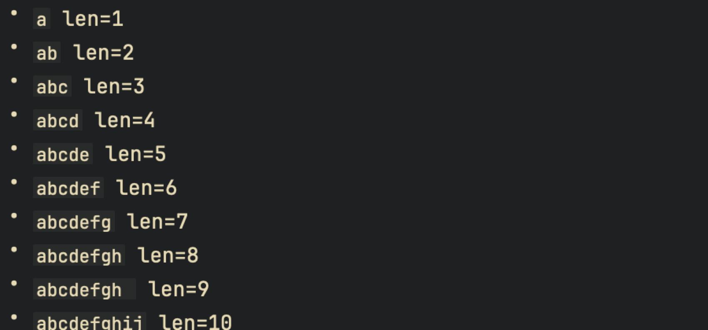
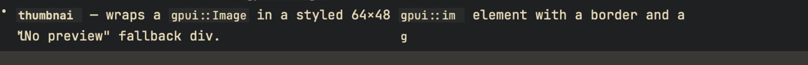
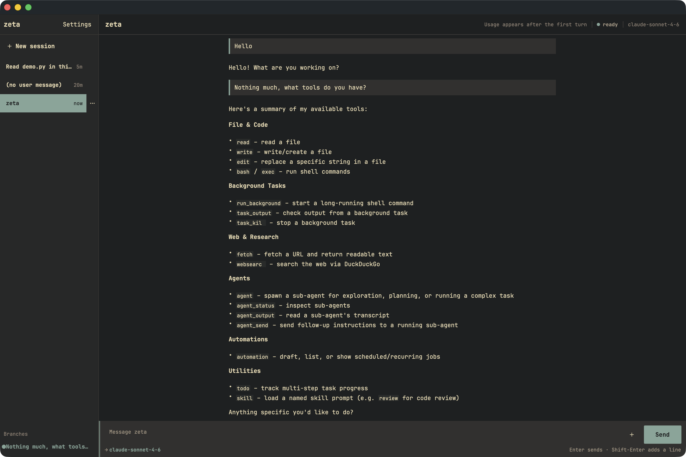
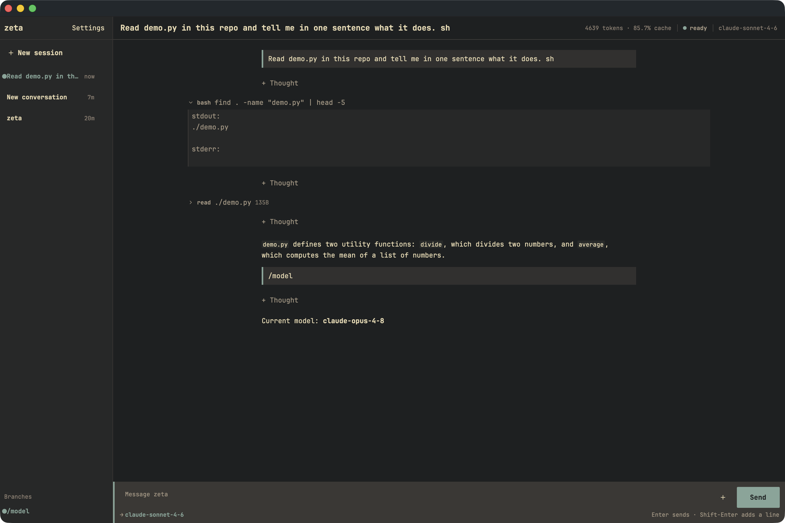
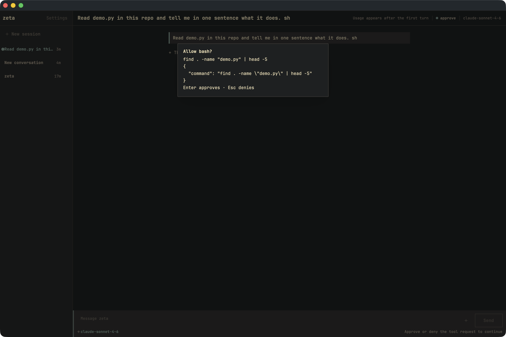
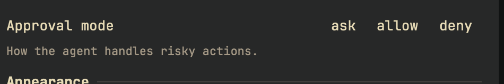
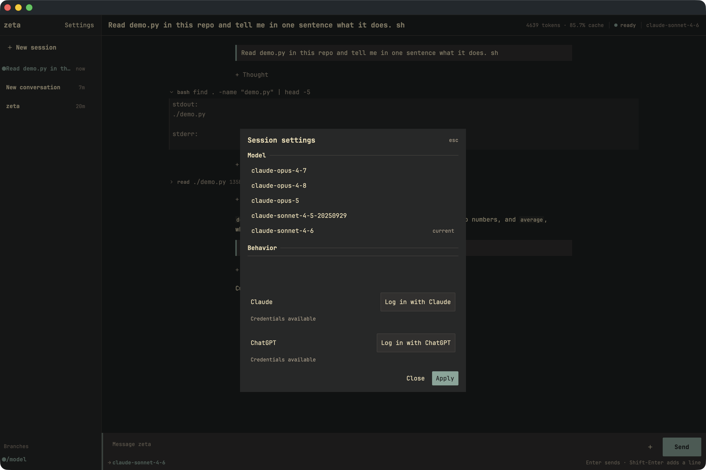
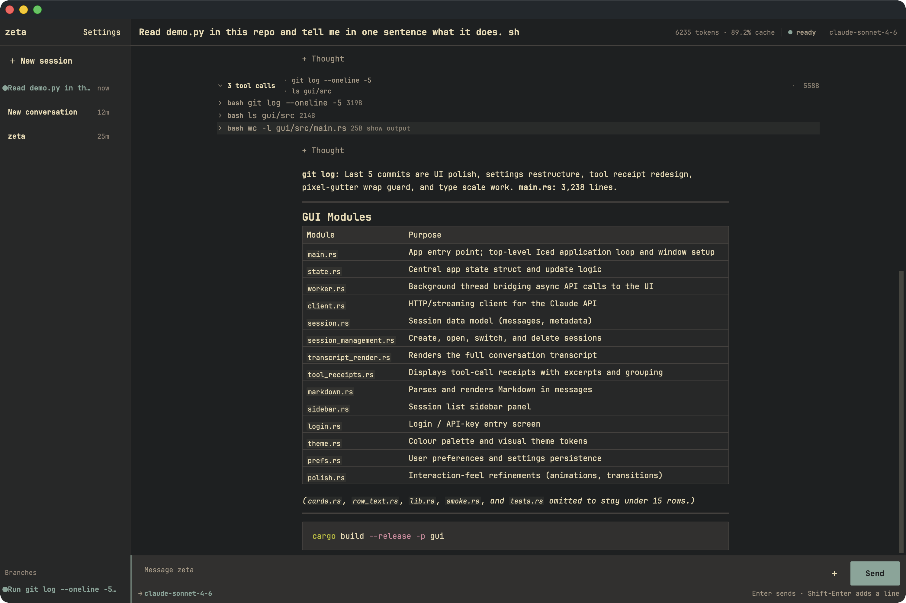
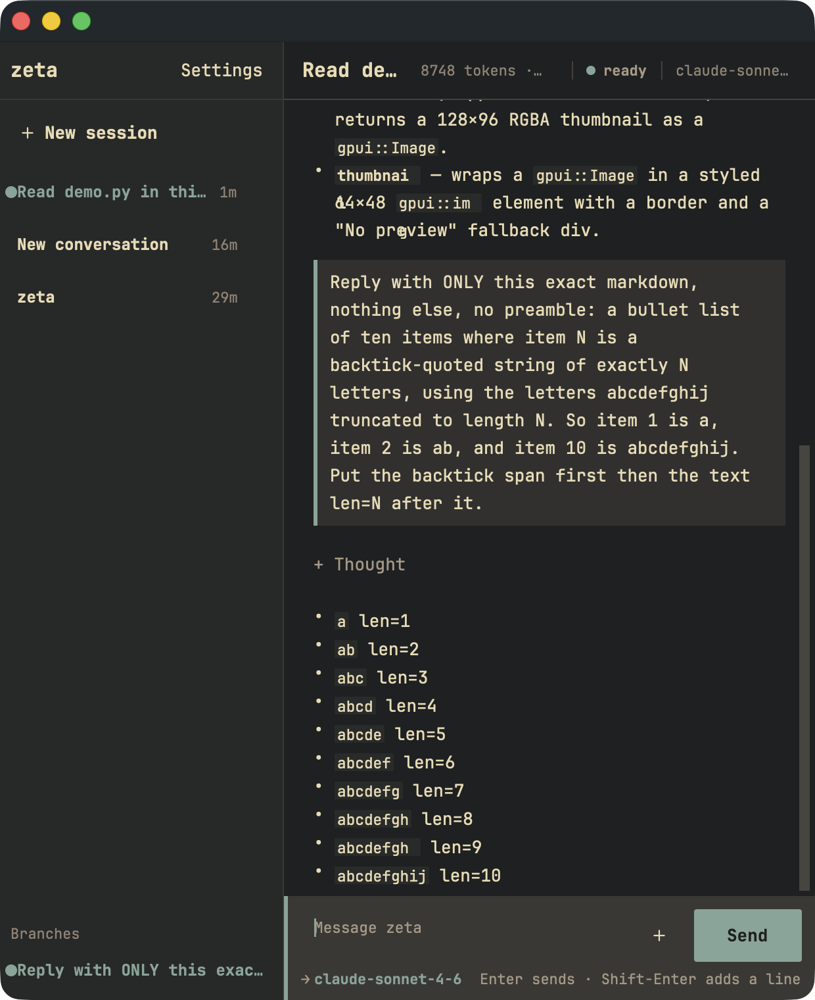

# Zeta GUI Everyday-Use Audit (2026-09-16)

**STATUS (2026-09-17): UI-POLISH-2 arc COMPLETE — the ranked findings shipped across PRs #171-#176** (ZETA-129 codespans A1/A2, ZETA-130 slash commands B1, ZETA-131 approvals B3/C1/C2, ZETA-132 settings C3/C4, ZETA-134 sidebar A4/A5/A6 + A3/C7/D6, ZETA-135 wiki-look restyle superseding D-series layout items). Remaining from this audit: D1/D3 partially (ZETA-133 held for reassessment against the wiki look), B7 a11y (deferred arc). Main at `2560085`.

Hands-on audit of the gpui GUI on `main` @ `d21ab5a` (ZETA-126), driven with
synthetic mouse/keyboard against the real Claude provider and real `~/.zeta`,
at 1500x1000 pt and 620x760 pt. Every finding came from a screenshot of the
running app, not from reading code. Evidence in `zeta/assets/gui-audit-*.png`.

Scenarios run: cold start, create session, ask a question, approve tools, change
settings, multi-tool task, slash command, `@file` mention, interrupt, expand
receipts, rename/delete a session, resize, kill the server and reconnect, select
and copy, switch sessions, Cmd-N.

## A. Rendering bugs

- **A1 (HIGH) Inline code spans of exactly 9 characters lose their last glyph.**
  Repro with a length 1..10 backtick ladder: 1-8 correct, **9 renders 8 glyphs
  plus an empty slot**, 10 correct. Real damage: `task_kill`→`task_kil`,
  `websearch`→`websearc`, `thumbnail`→`thumbnai`. Present in sessions created
  before the audit, so not test-induced.
  
- **A2 (HIGH) Code spans at a wrap boundary paint overflow glyphs onto the next
  line** at a stale x-position, over existing text. `gpui::image` → `gpui::im`
  with a bare `g` underneath; the `l` dropped from `thumbnail` collides with the
  quote of `"No preview"`. At 620 pt, `64×48` → `4×48` and `preview` →
  `pr(g)eview`.
  
  `gui/src/markdown.rs:1` states GPUI Kit owns parsing and rendering, so A1/A2
  most likely live in the Kit markdown text layer (gpui-kit 0.6 / gpui-pre
  0.3.4). Distinct from the TUI's [[harness-parity-arc]]-era ZETA-40 (unclosed
  spans at stream-commit boundaries) — this one drops a glyph from a *closed,
  completed* span.
- **A3** Expanded `read` receipt header reads `read read`; the path shown on the
  collapsed row is lost.
- **A4** Server placeholder leaks into the sidebar. `src/zeta/core/session.py:501`
  emits the literal `"(no user message)"`; `gui/src/sidebar.rs:34` maps only an
  *empty* preview to `New conversation`, so it passes through after a reconnect.
- **A5** Selecting a session rewrites its `updated_at` to "now" without
  re-sorting the sidebar — list ends up `5m, 20m, now`.
  
- **A6** After Cmd-N the green active dot moves to the new row but the selected
  background stays on the old row; two rows read as current.

## B. Missing everyday features

- **B1 (HIGH) No slash commands at all.** Typing `/` opens nothing; there is no
  slash dispatch in `gui/src/`. `/model` posted to the model as chat text and it
  answered "Current model: claude-opus-4-8" while the status bar read
  `claude-sonnet-4-6`. The TUI's command menu and `.zeta/commands/*.md` macros
  never reached the GUI, so the canned ops chores in
  [[henry-daily-driver-profile]] are unavailable there.
  
- **B2** `@file` is plain text in the GUI — no autocomplete, no chip, no
  missing-path notice (the README promises a notice that blocks the message).
  ZETA-119 shipped this for the TUI only.
- **B3 (HIGH) Approvals have no memory.** Enter approves, Esc denies; no "always
  allow this tool", no per-command or per-directory scope. The only escape is
  the global `allow` mode, which is all-or-nothing.
  
- **B4** The approval dialog is keyboard-only; clicking it does nothing.
- **B5** No copy button on code blocks or messages (drag-select + Cmd-C works).
- **B6** Menu bar is `Apple | zeta-gui (About, Quit) | File (New Session)`. No
  Edit menu, no Window menu, no Preferences (Cmd-,), no Close Window (Cmd-W).
- **B7** No accessibility tree: `window 1` exposes one AXGroup, three
  traffic-light AXButtons, one AXStaticText. Tool state is colour-only by design
  (`gui/src/state.rs:79-90`) with no text alternative.
- **B8** Right-click does nothing; Rename/Delete hide behind a hover-only `…`.
- **B9** The sidebar never collapses — 215 pt of a 620 pt window.
- **B10** No session search, filter, date grouping, or per-session cwd.
- **B11** No timestamps, no turn duration, no cost.

## C. Feedback and state visibility

- **C1 (HIGH) Approval mode `ask/allow/deny` has no selected state.** All three
  render identically before and after clicking — `Button::ghost().selected(...)`
  (`gui/src/main.rs:1460-1470`), invisible on this theme.
  
- **C2** Apply closes the modal silently and nothing in the main UI ever shows
  the agent is in `allow` (yolo) mode. Verified: three tools ran unprompted with
  no warning anywhere.
- **C3** Settings opens looking broken — the scroll viewport cuts exactly at the
  `Behavior` header with no scrollbar, so approval mode, theme, font and font
  size all read as absent.
  
- **C4** Settings scroll position persists across close/reopen.
- **C5** ~20 s of silence at turn start: no thinking row, no pending-tool row, no
  spinner — only a small `streaming` chip and a footer line.
- **C6** Usage resets to "Usage appears after the first turn" on reconnect and on
  session switch, even with history present.
- **C7** Send stays enabled on an empty composer and silently does nothing.
- **C8** `New session` is disabled while a turn runs.
- **C9** No alert when a turn blocks on an approval in the background.

## D. Layout and visual design

- **D1** Four left edges in one transcript: tool rows ~x480, `+ Thought` ~x668,
  prose ~x666, group byte-count right-aligned ~x1790. Expanded tool cards run
  near full width while prose stays narrow.
  
- **D2** The group total (`558B`) is pinned ~1000 px from the content it sums.
- **D3** Content is top-anchored: a four-row answer sat at the top of a 1000 pt
  window with 60% empty space below, farthest from the composer.
- **D4** `+ Thought` shows a `+` that never expands (header-only by design,
  `gui/src/state.rs:63-68`). Three appeared in a four-row turn.
- **D5** Receipt expansion is hover-only (`show output` on the hovered row).
- **D6** Expanded bash receipts print an empty `stderr:` label; no exit code, no
  duration, no cwd.
- **D7** "Jump to latest" is an unlabelled low-contrast circle that floats over
  transcript text and hides it.
- **D8** Delete is the accent primary button in the delete dialog (copy itself is
  good: "Delete this conversation and its stored files? This cannot be undone.").
- **D9** The approval popover covers the tool card and thinking rows it asks
  about.
- **D10** The approval dialog prints the command twice — formatted, then again as
  raw JSON arguments.
- **D11** At 620 pt the session title collapses to `Read de…` while three status
  chips keep their width.
  
- **D12** The row hover `…` button paints outside its own row highlight.

## E. Launch and environment

- **E1** `make gui` runs a bare binary. It gets a Dock tile and menu bar, but
  `NSRunningApplication.activate` did not raise it; until an AX `set frontmost`
  landed, every click was dropped.
- **E2 GOTCHA: `make gui` silently attaches to any live
  `~/.zeta/run/serve.sock`** and spawns only when the socket is missing or stale
  (`gui/src/worker.rs:415-445`). It attached to a server started two days
  earlier, running older code, and ignored `ZETA_BIN`. Nothing in the UI names
  the server or its version. Kill the old `zeta serve` before verifying current
  code — same class as [[instance-pinning-verification]].
- **E3** Reconnect is good: red banner, `Reconnect` button, disabled composer,
  `offline` chip, clean recovery that spawns a fresh server. No auto-retry; the
  banner text is redundant ("Connection lost: connection failed: server closed
  the connection").

## Driving the GUI with synthetic events (reusable recipe)

Claude.app has no Accessibility permission; Terminal.app does. What worked: a
polling command-queue daemon launched with `open -a Terminal <script>.command`
posting CGEvents, while screenshots stay on the Claude side (Terminal lacks
Screen Recording). GPUI ignores `keyboardSetUnicodeString` — type with real
virtual keycodes. Only AX `set frontmost of process "zeta-gui"` raises the
window. `screencapture -l <windowid>` returns a stale backing store for gpui
windows — capture twice with a short gap.

## Ranked fix order proposed

1. A1 + A2 — wrong text on screen beats all polish.
2. B1 — slash commands, starting `/model`, `/compact`, custom macros. The
   `/model` hallucination is the worst single user-facing failure found.
3. B3 + C1 + C2 — approval memory, visible selected mode, persistent `allow`
   indicator.
4. C3 — Settings shows its sections on open.
5. D1 + D3 — one content column, bottom-anchored.
6. A4 + A5 + A6 — sidebar state correctness.
7. B7 — accessibility tree and a non-colour tool-state cue.

## What already works

Markdown tables and fenced code render cleanly with syntax colours; tool grouping
at 3+ receipts reads well expanded; the delete confirmation copy is precise;
connection loss is handled clearly and recovers in one click; drag-select plus
Cmd-C copies exactly the covered text; session switching loads full history fast;
the attach button opens a real native panel.

Related: [[zeta-gui-wiki-run-parity]], [[harness-parity-arc]],
[[rendering-philosophy]], [[default-quiet]], [[laws-of-ux]],
[[henry-daily-driver-profile]].
